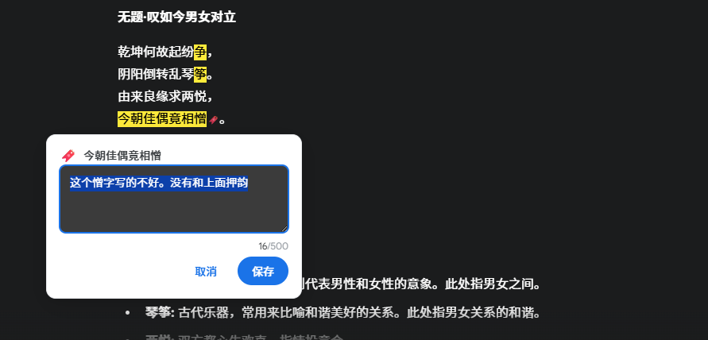

# Highlight by Marss

[中文文档](README.md) | English

A Chrome extension specifically designed for AI chat platforms that allows you to easily highlight important content in AI responses, add comments, and copy responses with complete markup.

The design philosophy of this plugin is:
> This is an upgrade to the AI communication paradigm. (Special thanks to @XiaoQiJie for the requirement)
> AI conversations are currently one-dimensional (text only), and three-dimensional communication (highlighting + comments) is obviously more efficient.



## 🚀 User Guide

### Basic Operations
1. Select AI response text for automatic highlighting
2. Ctrl+Click to remove highlight (Cmd+Click on Mac)
3. Ctrl+Z to undo last highlight (Cmd+Z on Mac)

### Comment Features
1. **Add Comment**: Click highlighted text to open comment input box
2. **Edit Comment**: Click highlighted text or 🔖 icon again to edit
3. **View Comment**: Hover over 🔖 icon for quick view, or click highlighted text again
4. **Shortcuts**:
   - Ctrl+Enter: Save comment (Cmd+Enter on Mac)
   - Escape: Cancel editing
   - Click outside: Close dialog

### Enhanced Copy
1. Highlight and (optionally) add comments
2. Click platform's native copy button to get formatted content:
```xml
<highlight comment="My comment">Important text</highlight>
```

## 💡 Design Highlights

### User Experience Optimization
- **Anti-mistouch mechanism**: No comment trigger within 300ms after highlighting to avoid conflicts
- **Smart positioning**: Comment dialog automatically avoids screen boundaries
- **Inline indicators**: 🔖 icons follow text scrolling, won't "float away"
- **Visual consistency**: Uses 🔖 bookmark icon, clearly visible on white backgrounds

### Technical Features
- **Zero DOM pollution**: Uses CSS.highlights API without modifying page structure
- **Precise identification**: Smart detection of AI response areas to avoid misoperations
- **Graceful degradation**: Fallback solutions for different browser environments
- **Performance optimization**: Event debouncing and smart updates to avoid unnecessary DOM operations
- **🆕 Modular architecture**: Platform adapter pattern with unified interface abstraction
- **🆕 Extensibility**: Solid foundation for multi-platform support, easy expansion to more AI platforms

## 🛠️ Installation

### Developer Installation
1. Clone this repository locally
2. Open Chrome extension management page `chrome://extensions/`
3. Enable "Developer mode"
4. Click "Load unpacked extension"
5. Drag the directory to extensions (highlight-by-marss)
6. Visit supported platforms to start using:
   - [Gemini](https://gemini.google.com)
   - [Claude](https://claude.ai)
   - [Grok](https://grok.com)
   - [ChatGPT](https://chat.openai.com)
   - [Doubao](https://doubao.com)

### Installation Verification
- F12 console shows "Highlight by Marss loaded"
- Selecting text in AI responses highlights normally
- Clicking highlighted text opens comment input box

## 📁 Project Structure

```
highlight-by-marss/
├── manifest.json           # Chrome extension configuration
├── src/
│   ├── content.js          # Main logic (highlighting + adapter integration)
│   ├── copy-enhancer.js    # Copy enhancement (button recognition + smart copy)
│   ├── comment-manager.js  # Comment management (UI + indicators + interaction)
│   ├── platform/           # 🆕 Platform adapter architecture
│   │   ├── platform-adapter.js  # Adapter base interface
│   │   ├── gemini-adapter.js     # Gemini platform adapter
│   │   ├── claude-adapter.js     # Claude platform adapter
│   │   └── ...............js     # Other platform adapters
│   └── background.js       # Background script
├── styles/
│   ├── content.css         # Highlighting styles
│   └── comment.css         # Comment UI styles (Material Design)
└── specs/                  # Feature specification documents
    └── highlight-by-marss/
        ├── requirements.md # Requirements document
        ├── design.md      # Design document
        └── tasks.md       # Task list
```

## 🎯 Supported Platforms

### ✅ Currently Supported
- **Gemini** (gemini.google.com)
- **Claude** (claude.ai) 
- **Grok** (grok.com)
- **ChatGPT** (chat.openai.com / chatgpt.com)
- **Doubao** (doubao.com / www.doubao.com)

## 🔮 Future Plans

- No plans yet (looking forward to your feedback)

## 🤝 Contributing

Issues and Pull Requests are welcome!

### Development Environment
- Based on Manifest V3
- Uses vanilla JavaScript with no framework dependencies
- Follows Material Design specifications

### Main Development Principles
- User experience first
- Zero-intrusive design
- Performance and stability equally important
- Clean and maintainable code

---

**Make AI conversations more efficient, transforming from one-dimensional linear to three-dimensional communication (highlighting + comments)!** ✨