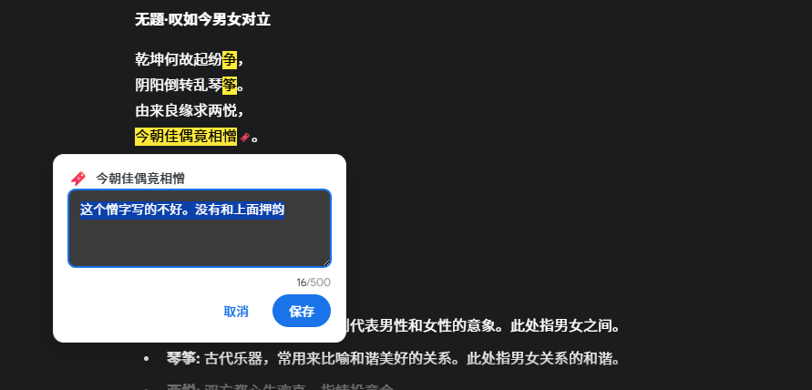

# Highlight by Marss

中文文档 | [English](README-en.md)

   一个专为AI聊天平台设计的Chrome扩展，让你能轻松高亮AI回复中的重要内容、添加评论，并复制带完整标记的回复。

本插件的设计哲学是：
> 与AI对话目前是一维的（只有文字），三维沟通（高亮+评论）显然更为高效。
> 这是一次与AI沟通范式的升级。（特别感谢 @小七姐 提出的需求）



## 🚀 使用指南

### 下载并安装
1. 从 [Release 页面](https://github.com/MarssZ/Highlight-by-Marss/releases/tag/download) 下载最新版本的插件压缩包（highlight-by-marss.zip）。
2. 解压下载的压缩包到一个方便的位置，例如 `C:\highlight-by-marss`。
3. 打开Chrome浏览器，进入扩展管理页面（`chrome://extensions/`）。
4. 开启"开发者模式"。
5. 点击"加载已解压的扩展程序"，将解压后的目录 `C:\highlight-by-marss` 拖入。
6. 插件图标将出现在浏览器工具栏中。

### 使用流程
1. 划词高亮、点击添加评论
2. 点击AI回复下方的复制按钮
3. 粘贴即可获得带XML标记的内容

### 基础操作
1. **Alt+选中**AI回复文本触发高亮
2. Ctrl+点击移除高亮（Mac用Cmd+点击）
3. Ctrl+Z撤销最后高亮（Mac用Cmd+Z）

### 评论功能
1. **添加评论**：点击高亮文本弹出评论输入框
2. **编辑评论**：再次点击高亮文本或🔖图标编辑
3. **查看评论**：鼠标悬停🔖图标快速查看，或再次点击高高文本
4. **快捷操作**：
   - Ctrl+Enter：保存评论（Mac用Cmd+Enter）
   - Escape：取消编辑
   - 点击外部：关闭对话框

### 复制增强
1. 高亮并（可选）添加评论
2. 点击平台原生复制按钮获得格式化内容：
```xml
<highlight comment="我的评论">重要文本</highlight>
```

## 💡 设计亮点

### 用户体验优化
- **防误触机制**：Alt键触发高亮，避免复制时误触；高亮后300ms内不触发评论
- **智能定位**：评论对话框自动避开屏幕边界
- **内联指示器**：🔖图标跟随文本滚动，不会"飘走"
- **视觉一致**：使用🔖书签图标，白色背景下清晰可见

### 技术特色
- **零DOM污染**：使用CSS.highlights API，不修改页面结构
- **精确识别**：智能检测AI回复区域，避免误操作
- **优雅降级**：支持不同浏览器环境的回退方案
- **性能优化**：事件去抖、智能更新，避免不必要的DOM操作
- **🆕 模块化架构**：平台适配器模式，统一接口抽象
- **🆕 扩展性**：为多平台支持奠定坚实基础，轻松扩展至更多的AI平台。

## 🛠️ 验证安装
- F12控制台显示 "Highlight by Marss loaded"
- 在AI回复中选择文本能正常高亮
- 点击高亮文本能弹出评论输入框

### 支持平台
访问以下平台开始使用：
- [Gemini](https://gemini.google.com)
- [Claude](https://claude.ai)
- [Grok](https://grok.com)
- [ChatGPT](https://chat.openai.com)
- [豆包](https://doubao.com)


## 🔮 未来规划

- 暂无规划（期待您的反馈）

## 🤝 贡献指南

欢迎提交Issue和Pull Request！

### 开发环境
- 基于Manifest V3
- 使用原生JavaScript，无框架依赖
- 遵循Material Design设计规范

### 主要开发原则
- 用户体验优先
- 零侵入式设计
- 性能和稳定性并重
- 代码简洁易维护

---

**让AI对话更高效，从一维线性变成三维沟通（高亮+评论）！** ✨