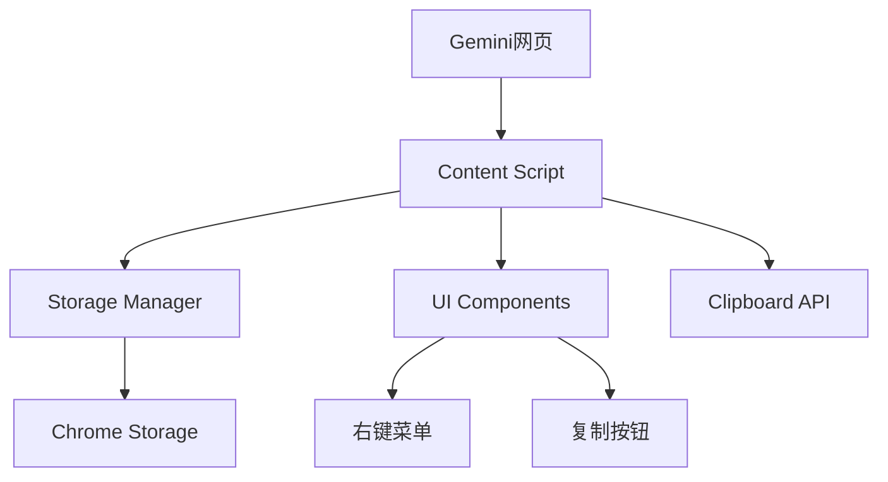
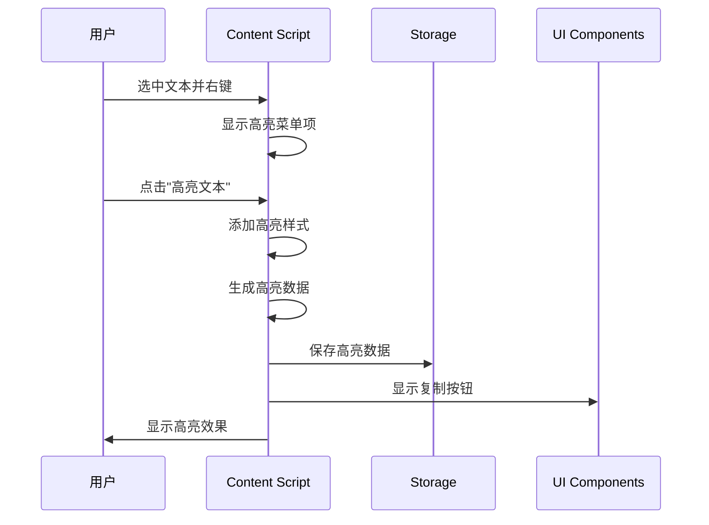
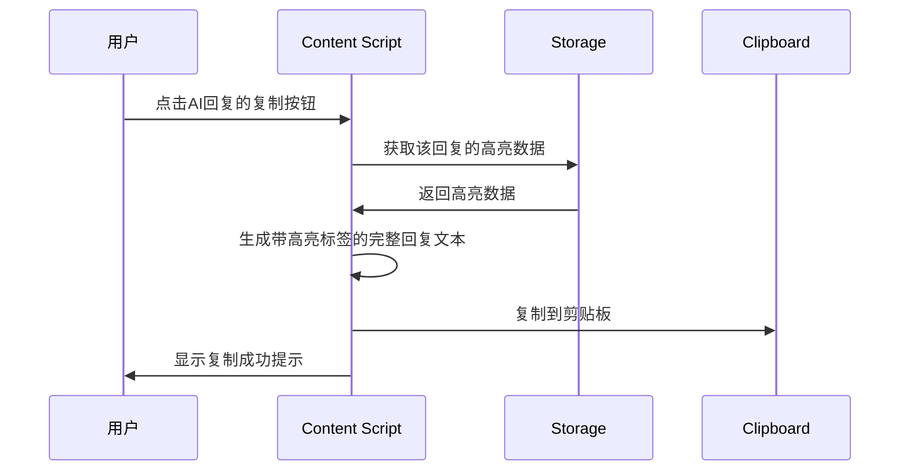
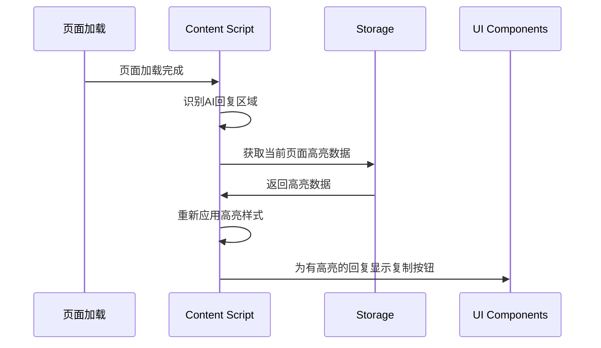

# AI Highlight Assistant - 设计文档

## 概述

AI Highlight Assistant 是一个Chrome浏览器扩展，允许用户在Gemini平台的AI回复中高亮重要文本，并通过剪贴板复制包含高亮标记的完整AI回复内容。采用简化的复制粘贴方案，避免复杂的DOM操作，提高稳定性和通用性。

## 架构设计



## 核心组件

### 1. Content Script (`content.js`)
负责在Gemini页面中注入功能逻辑

**职责：**
- 监听页面加载，识别AI回复区域
- 处理文本选中和右键菜单事件
- 管理高亮样式的添加和移除
- 在包含高亮的AI回复右上角显示复制按钮
- 生成包含高亮标记的完整AI回复文本并复制到剪贴板
- 页面刷新后恢复高亮状态

**关键方法：**
```javascript
// 添加高亮
addHighlight(selectedText, range)
// 移除高亮  
removeHighlight(highlightId)
// 复制整个AI回复（含高亮标记）
copyMessageWithHighlights(messageId)
// 恢复高亮状态
restoreHighlights()
// 显示/隐藏复制按钮
toggleCopyButton(messageElement, hasHighlights)
```

### 2. Storage Manager (`storage.js`)
管理高亮数据的持久化存储

**数据结构：**
```javascript
{
  conversations: {
    [conversationId]: {  // 基于URL路径提取的对话ID
      messages: {
        [messageHash]: {  // 基于消息内容的hash
          content: string,        // 完整消息内容
          highlights: [
            {
              id: string,
              text: string,
              startOffset: number,
              endOffset: number,
              timestamp: number
            }
          ],
          lastUpdated: timestamp
        }
      }
    }
  }
}
```

**关键方法：**
```javascript
saveHighlight(conversationId, messageHash, highlightData)
getHighlights(conversationId, messageHash)
removeHighlight(conversationId, messageHash, highlightId)
clearHighlights(conversationId, messageHash)
generateConversationId(url)
generateMessageHash(content)
```

### 3. UI Components (`ui.js`)
处理用户界面元素

**组件：**
- **右键菜单项** - "高亮选中文本" / "取消高亮"
- **复制按钮** - 显示在包含高亮的AI回复右上角，样式类似聊天应用的消息操作按钮
- **通知提示** - 复制成功的反馈

**复制按钮设计：**
- 位置：AI回复容器右上角
- 样式：半透明圆形图标，hover时高亮
- 显示条件：仅当AI回复包含高亮内容时显示
- 图标：复制/剪贴板图标

### 4. Platform Adapter (`gemini-adapter.js`)
Gemini平台特定的DOM选择器和逻辑

**职责：**
- 识别AI回复容器
- 生成唯一的消息ID
- 处理Gemini特有的DOM结构

## 数据模型

### 高亮数据存储示例
```javascript
{
  conversations: {
    "gemini-chat-abc123": {
      messages: {
        "hash-def456": {
          content: "机器学习中，决策树容易理解，随机森林准确率高，但神经网络需要更多数据。",
          highlights: [
            {
              id: "highlight-uuid-1",
              text: "决策树",
              startOffset: 6,
              endOffset: 9,
              timestamp: 1640995200000
            },
            {
              id: "highlight-uuid-2", 
              text: "神经网络",
              startOffset: 25,
              endOffset: 29,
              timestamp: 1640995300000
            }
          ],
          lastUpdated: 1640995300000
        }
      }
    }
  }
}
```

### 生成的复制内容格式
```
机器学习中，<highlight>决策树</highlight>容易理解，随机森林准确率高，但<highlight>神经网络</highlight>需要更多数据。
```

## 核心流程

### 1. 高亮文本流程


### 2. 复制完整AI回复流程


### 3. 页面恢复高亮流程


## 错误处理

### 1. DOM结构变化
- **问题：** Gemini更新导致选择器失效
- **处理：** 使用多重选择器fallback，记录错误日志

### 2. 存储失败
- **问题：** Chrome Storage API调用失败
- **处理：** 降级到sessionStorage，提示用户

### 3. 复制失败
- **问题：** Clipboard API不可用或被阻止
- **处理：** 降级到document.execCommand，显示手动复制提示

## 测试策略

### 1. 单元测试
- Storage Manager的数据操作
- 高亮数据生成和格式化逻辑
- 完整回复文本标记生成功能

### 2. 集成测试
- 在Gemini页面的端到端高亮流程
- 复制按钮的显示/隐藏逻辑
- 页面刷新后的恢复功能
- 复制完整回复到剪贴板的流程

### 3. 兼容性测试
- 不同Chrome版本的API兼容性
- Gemini页面结构变化的适应性

## 技术决策

### 1. 为什么选择剪贴板复制而不是自动插入？
- **简单性：** 避免复杂的DOM操作和输入框识别
- **稳定性：** 不依赖具体的页面结构，更少的失效风险
- **通用性：** 未来扩展到其他AI平台更容易

### 2. 为什么使用Chrome Storage而不是LocalStorage？
- **持久性：** 扩展卸载重装后数据不丢失
- **跨标签页：** 多个Gemini标签页共享高亮数据
- **配额：** 更大的存储空间

### 3. 复制按钮的UI设计原则
- **上下文相关：** 只在有高亮内容时显示，明确表示操作范围
- **熟悉性：** 模仿聊天应用的消息操作按钮，用户容易理解
- **非干扰性：** 半透明设计，不影响阅读体验