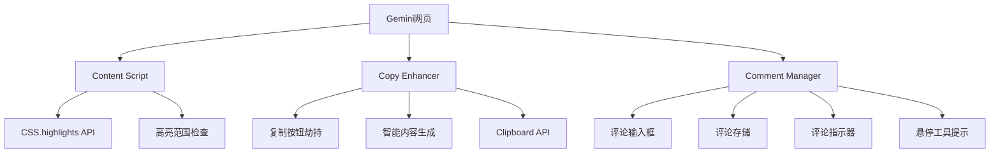
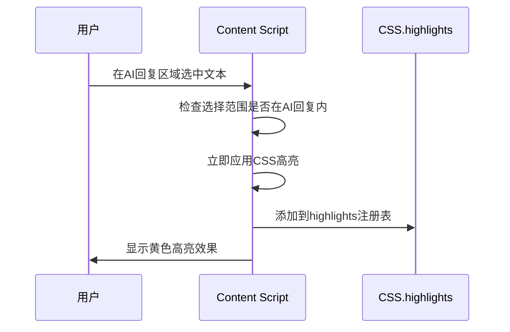
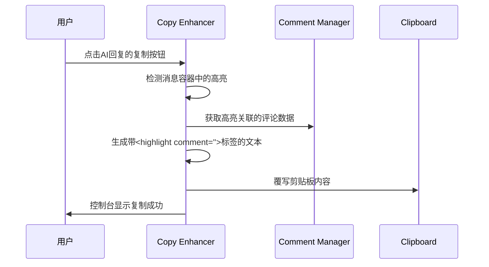
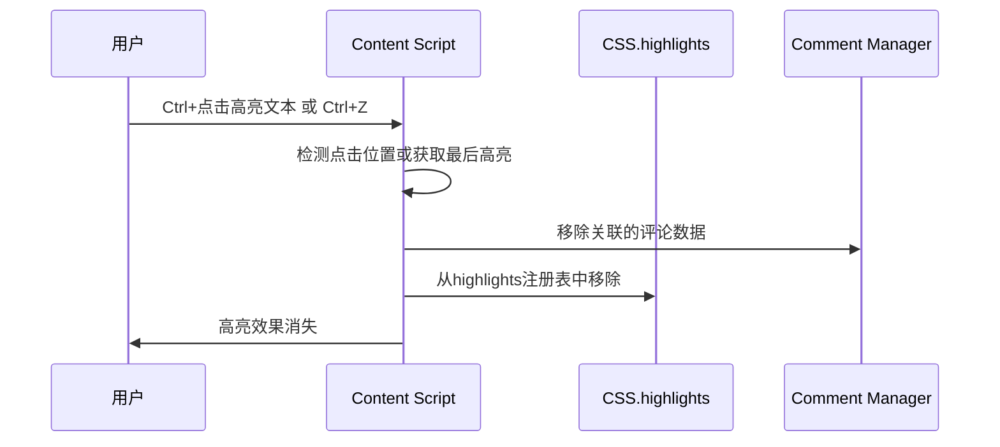
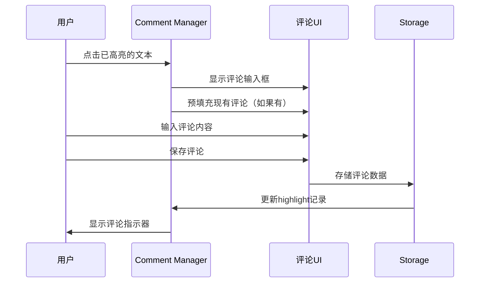
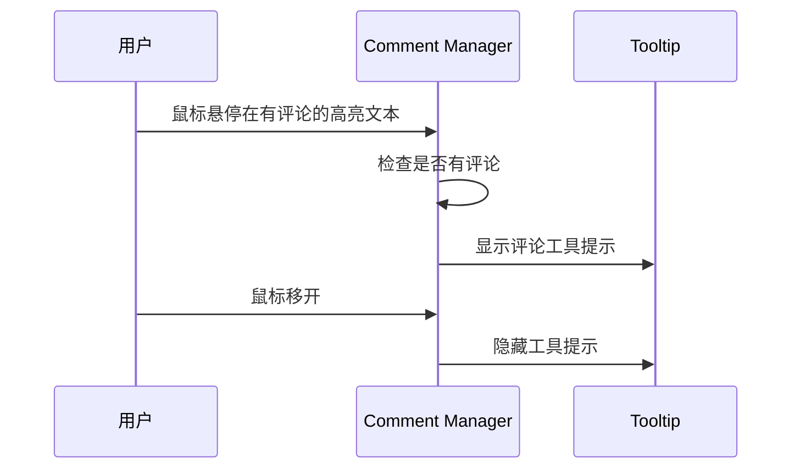
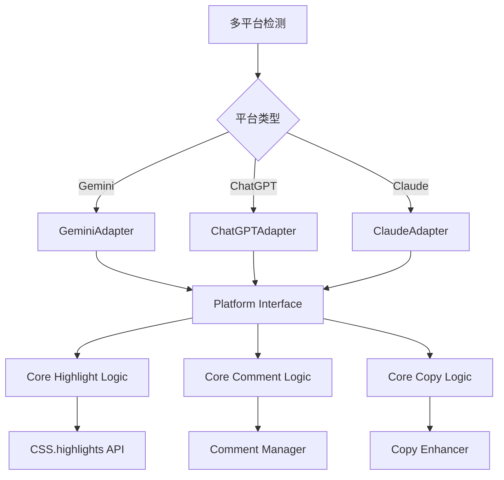

# AI Highlight Assistant - 设计文档

## 概述

AI Highlight Assistant 是一个Chrome浏览器扩展，允许用户在AI聊天平台的AI回复中高亮重要文本并添加个人评论，通过劫持原生复制按钮来复制包含高亮标记和评论的完整AI回复内容。

## 架构演进

### 阶段1：MVP实现（Gemini平台）✅ 已完成
**专注单平台，验证核心价值**

**已实现的核心功能：**
- ✅ 在AI回复区域内选中文本立即高亮（CSS.highlights API + 智能降级）
- ✅ Ctrl+点击移除高亮，Ctrl+Z撤销高亮
- ✅ 劫持AI回复原生复制按钮，智能生成带`<highlight>`标签的内容
- ✅ 高亮范围限制在AI回复区域，避免误操作
- ✅ 点击高亮文本显示Material Design评论对话框
- ✅ 评论与高亮文本关联存储，🔖指示器显示
- ✅ 复制时包含评论信息：`<highlight comment="评论">文本</highlight>`

### 阶段2：多平台架构重构 🔄 规划中
**保持功能不变，重构为平台无关架构**

**重构目标：**
- 🎯 提取平台特定逻辑到适配器层
- 🎯 核心高亮/评论逻辑保持不变
- 🎯 支持ChatGPT、Claude等主流平台
- 🎯 零破坏性：Gemini用户体验完全不变

## 架构设计（MVP实现）



## 核心组件

### 1. Content Script (`content.js`) ✅ 已实现，需扩展
负责高亮功能的核心逻辑

**职责：**
- 监听AI回复区域内的文本选择
- 使用CSS.highlights API应用高亮（支持跨元素）
- 智能降级到传统DOM高亮
- Ctrl+点击移除高亮，Ctrl+Z撤销
- 限制高亮范围在AI回复容器内
- 🆕 与Comment Manager协作处理点击事件

**关键方法：**
```javascript
// 检查选择范围
isSelectionInAIResponse(selection)
// CSS高亮
applyHighlightCSS(selection)
// 传统高亮（降级）
applyHighlightFallback(selection)
// 移除高亮
removeHighlightAtPoint(clickPoint)
// 🆕 处理高亮点击事件
handleHighlightClick(event)
```

### 2. Copy Enhancer (`copy-enhancer.js`) ✅ 已实现，需扩展
负责劫持和增强原生复制功能

**职责：**
- 精确识别AI回复的复制按钮（`data-test-id="copy-button"`）
- 监听复制按钮点击事件
- 检测消息容器中的高亮内容
- 🆕 获取高亮关联的评论数据
- 生成带`<highlight comment="">`标签的增强文本
- 覆写剪贴板内容

**关键方法：**
```javascript
// 识别复制按钮
findAndSetupCopyButtons()
// 处理复制点击
handleCopyButtonClick(button, event)
// 🆕 生成包含评论的增强内容
generateHighlightedTextWithComments(container)
// 剪贴板操作
copyToClipboard(text)
```

### 3. Comment Manager (`comment-manager.js`) 🆕 新增组件
负责评论功能的核心逻辑

**职责：**
- 管理高亮文本的评论数据
- 显示评论输入界面
- 处理评论的保存和编辑
- 显示评论指示器和工具提示
- 评论数据的持久化存储

**关键方法：**
```javascript
// 显示评论输入框
showCommentInput(highlightId, position)
// 保存评论
saveComment(highlightId, comment)
// 显示评论指示器
showCommentIndicator(highlightElement)
// 显示评论工具提示
showCommentTooltip(highlightElement, comment)
// 获取高亮的评论
getHighlightComment(highlightId)
```

## 数据模型（MVP简化版）

### 内存中高亮数据存储（含评论）
```javascript
// window.highlights Map存储
{
  1: {
    range: Range对象,
    text: "决策树", 
    comment: "这个算法很直观",
    timestamp: 1640995200000,
    hasComment: true
  },
  2: {
    range: Range对象,
    text: "神经网络",
    comment: "",
    timestamp: 1640995300000,
    hasComment: false
  }
}
```

### 生成的复制内容格式（含评论）
```
机器学习中，<highlight comment="这个算法很直观">决策树</highlight>容易理解，随机森林准确率高，但<highlight>神经网络</highlight>需要更多数据。
```

## 核心流程（MVP实现）

### 1. 高亮文本流程 ✅


### 2. 智能复制流程（含评论）✅


### 3. 移除高亮流程 ✅


### 4. 添加评论流程 🆕


### 5. 评论悬停显示流程 🆕


## 技术决策（MVP实现）

### 1. 为什么选择CSS.highlights API？
- **无DOM污染：** 不修改页面HTML结构，性能更佳
- **跨元素支持：** 原生支持复杂文本选择，解决surroundContents问题
- **现代化：** Chrome原生API，专为高亮场景设计
- **智能降级：** 不支持时自动降级到传统DOM方法

### 2. 为什么劫持原生复制按钮而不是创建新UI？
- **用户习惯：** 保持原有操作流程，学习成本为零
- **界面简洁：** 不添加额外UI元素，不影响页面布局
- **稳定性：** 不依赖自定义UI的显示/隐藏逻辑
- **未来兼容：** 当Gemini UI更新时影响最小

### 3. 为什么限制高亮范围在AI回复区域？
- **精确定位：** 只在有意义的内容区域工作
- **避免误操作：** 防止在侧边栏、输入框等地方误触
- **符合使用场景：** 用户只需要高亮AI的回复内容

### 4. 评论功能的设计考虑 🆕
- **点击触发：** 点击高亮文本即可添加评论，操作简单直观
- **指示器显示：** 有评论的高亮文本显示小图标，区分有无评论
- **悬停显示：** 鼠标悬停显示评论内容，不占用页面空间
- **格式统一：** 复制时使用`comment`属性，与高亮标签统一

## 当前限制与未来增强

## 多平台架构设计（阶段2规划）

### 设计原则
遵循"好品味"架构设计：
1. **消除特殊情况** - 统一接口，平台差异通过适配器隔离
2. **Never break userspace** - Gemini用户的现有体验完全不变
3. **数据结构优先** - 核心逻辑不依赖具体平台
4. **简洁扩展** - 新平台支持只需实现适配器接口

### 平台适配器接口
```javascript
// 核心抽象 - 每个平台必须实现
interface PlatformAdapter {
  // 平台检测
  detectPlatform(): boolean;
  
  // DOM元素识别
  findResponseContainers(): Element[];
  findCopyButtons(): Element[];
  
  // 业务逻辑验证
  isValidResponseContainer(element: Element): boolean;
  getCopyButtonContainer(button: Element): Element;
}
```

### 重构后架构图


### 重构策略
**阶段2.1：提取适配器接口**
- 创建`PlatformAdapter`基类和`GeminiAdapter`实现
- 现有功能完全不变，只是包装一层

**阶段2.2：重构核心逻辑**
- `content.js`调用适配器接口而非硬编码逻辑
- 保持所有现有API和行为不变

**阶段2.3：验证Gemini功能**
- 确保重构后Gemini平台100%功能正常
- 性能和用户体验无任何退化

**阶段2.4：添加新平台**
- 实现`ChatGPTAdapter`和`ClaudeAdapter`
- 每个适配器只需30-50行代码

### MVP限制（保持不变）
- **数据持久化：** 当前高亮和评论数据存储在内存中，页面刷新后丢失
- **高亮管理：** 没有批量删除、导出等管理功能
- **评论管理：** 没有评论历史、批量编辑功能

### 未来可选增强
- Chrome Storage持久化存储（高亮+评论）
- 快捷键自定义（添加评论快捷键）
- 多主题高亮颜色