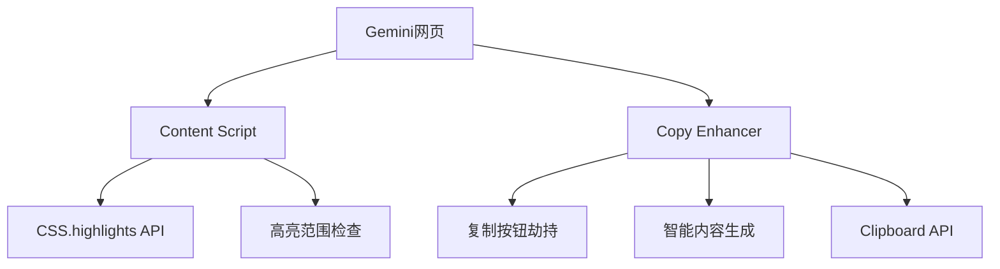
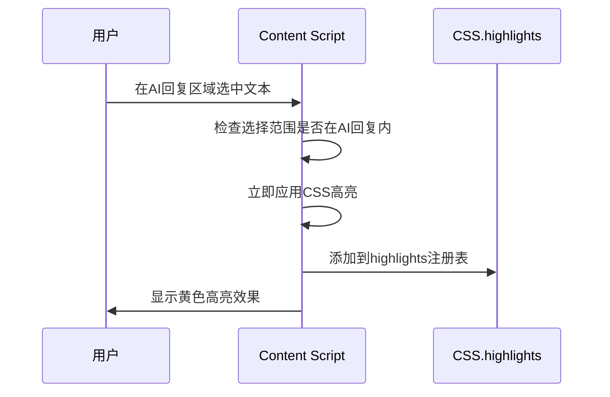
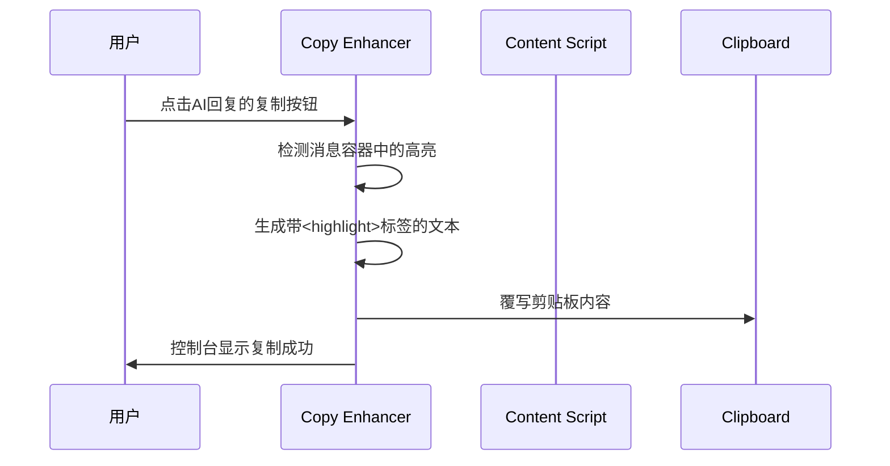
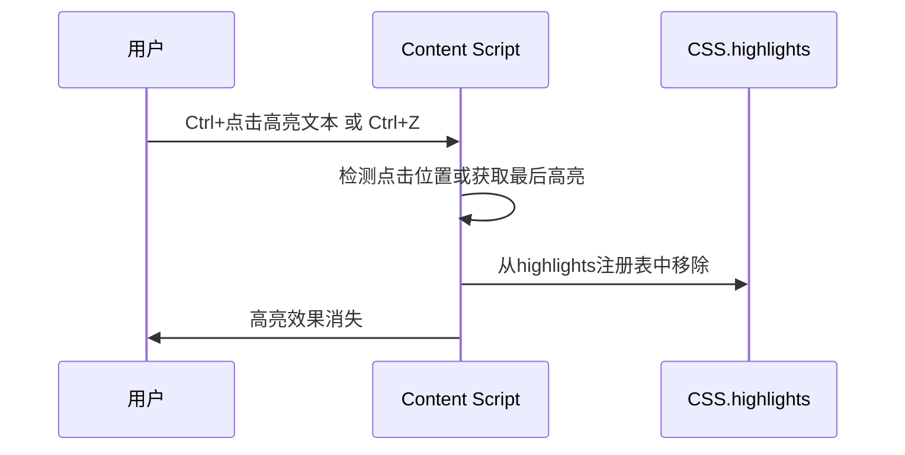

# AI Highlight Assistant - 设计文档

## 概述

AI Highlight Assistant 是一个Chrome浏览器扩展，允许用户在Gemini平台的AI回复中高亮重要文本，并通过劫持原生复制按钮来复制包含高亮标记的完整AI回复内容。

**MVP已实现的核心功能：**
- ✅ 在AI回复区域内选中文本立即高亮（CSS.highlights API + 智能降级）
- ✅ Ctrl+点击移除高亮，Ctrl+Z撤销高亮
- ✅ 劫持AI回复原生复制按钮，智能生成带`<highlight>`标签的内容
- ✅ 高亮范围限制在AI回复区域，避免误操作

## 架构设计（MVP实现）



## 核心组件

### 1. Content Script (`content.js`) ✅ 已实现
负责高亮功能的核心逻辑

**职责：**
- 监听AI回复区域内的文本选择
- 使用CSS.highlights API应用高亮（支持跨元素）
- 智能降级到传统DOM高亮
- Ctrl+点击移除高亮，Ctrl+Z撤销
- 限制高亮范围在AI回复容器内

**关键方法：**
```javascript
// 检查选择范围
isSelectionInAIResponse(selection)
// CSS高亮
applyHighlightCSS(selection)
// 传统高亮（降级）
applyHighlightFallback(selection)
// 移除高亮
removeHighlightAtPoint(clickPoint)
```

### 2. Copy Enhancer (`copy-enhancer.js`) ✅ 已实现
负责劫持和增强原生复制功能

**职责：**
- 精确识别AI回复的复制按钮（`data-test-id="copy-button"`）
- 监听复制按钮点击事件
- 检测消息容器中的高亮内容
- 生成带`<highlight>`标签的增强文本
- 覆写剪贴板内容

**关键方法：**
```javascript
// 识别复制按钮
findAndSetupCopyButtons()
// 处理复制点击
handleCopyButtonClick(button, event)
// 生成增强内容
generateHighlightedText(container)
// 剪贴板操作
copyToClipboard(text)
```

## 数据模型（MVP简化版）

### 内存中高亮数据存储
```javascript
// window.highlights Map存储
{
  1: {
    range: Range对象,
    text: "决策树", 
    timestamp: 1640995200000
  },
  2: {
    range: Range对象,
    text: "神经网络",
    timestamp: 1640995300000
  }
}
```

### 生成的复制内容格式
```
机器学习中，<highlight>决策树</highlight>容易理解，随机森林准确率高，但<highlight>神经网络</highlight>需要更多数据。
```

## 核心流程（MVP实现）

### 1. 高亮文本流程 ✅


### 2. 智能复制流程 ✅


### 3. 移除高亮流程 ✅


## 技术决策（MVP实现）

### 1. 为什么选择CSS.highlights API？
- **无DOM污染：** 不修改页面HTML结构，性能更佳
- **跨元素支持：** 原生支持复杂文本选择，解决surroundContents问题
- **现代化：** Chrome原生API，专为高亮场景设计
- **智能降级：** 不支持时自动降级到传统DOM方法

### 2. 为什么劫持原生复制按钮而不是创建新UI？
- **用户习惯：** 保持原有操作流程，学习成本为零
- **界面简洁：** 不添加额外UI元素，不影响页面布局
- **稳定性：** 不依赖自定义UI的显示/隐藏逻辑
- **未来兼容：** 当Gemini UI更新时影响最小

### 3. 为什么限制高亮范围在AI回复区域？
- **精确定位：** 只在有意义的内容区域工作
- **避免误操作：** 防止在侧边栏、输入框等地方误触
- **符合使用场景：** 用户只需要高亮AI的回复内容

## 当前限制与未来增强

### MVP有意简化的功能
- **数据持久化：** 当前高亮数据存储在内存中，页面刷新后丢失
- **高亮管理：** 没有批量删除、导出等管理功能
- **多平台支持：** 当前只支持Gemini，未来可扩展到其他AI平台

### 后续可选增强
- Chrome Storage持久化存储
- 高亮数据导入/导出
- 快捷键自定义
- 多主题高亮颜色