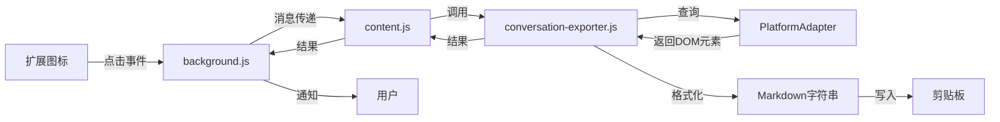
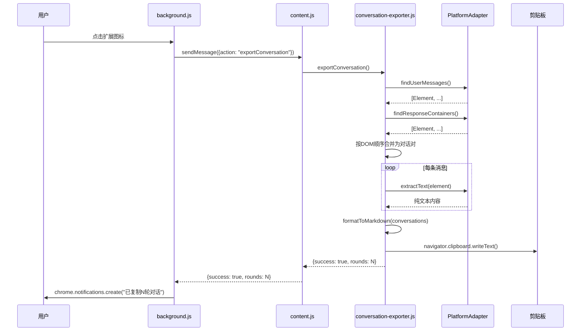

# 设计文档：对话导出功能

## 概述 (Overview)

### 功能目标
通过点击浏览器扩展图标，一键复制当前页面的完整AI对话（用户提问 + AI回复），自动格式化为结构化Markdown并写入剪贴板。

### 设计原则（Linus哲学）
1. **数据结构优先**：遍历DOM → 数据数组 → Markdown字符串，清晰的单向数据流
2. **消除特殊情况**：一问一答的严格配对，无需处理复杂轮次判断
3. **零破坏性**：完全独立的新功能，不影响现有高亮/评论/复制功能
4. **简洁执念**：新增代码 < 150行，复用现有平台适配器架构

### MVP范围
- ✅ 支持的平台：Gemini、Claude、ChatGPT、Grok
- ✅ 提取当前页面所有可见对话
- ✅ Markdown格式化（轮次、时间戳、平台名称）
- ✅ 写入剪贴板并显示成功提示
- ❌ 不处理懒加载历史消息（用户手动滚动）
- ❌ 不支持选区复制（二期功能）

---

## 架构设计 (Architecture)

### 总体架构



### 消息流设计



---

## 组件与接口 (Components and Interfaces)

### 1. 平台适配器接口扩展

**文件位置：** `src/platform/platform-adapter.js`

**新增方法：**
```javascript
class PlatformAdapter {
  /**
   * 🆕 查找用户消息容器
   * @returns {Element[]} 所有用户输入的消息容器，按DOM顺序排列
   */
  findUserMessages() {
    throw new Error('必须由子类实现');
  }

  /**
   * 🆕 从容器提取纯文本内容
   * @param {Element} container - 消息容器元素
   * @returns {string} 清理后的纯文本内容（移除UI元素、引用标记等）
   */
  extractText(container) {
    throw new Error('必须由子类实现');
  }

  /**
   * 🆕 获取平台显示名称
   * @returns {string} 平台名称（如 "Gemini"、"Claude"）
   */
  getPlatformDisplayName() {
    throw new Error('必须由子类实现');
  }
}
```

**实现要求：**
- 每个平台适配器（`gemini-adapter.js`、`claude-adapter.js` 等）必须实现这3个方法
- `findUserMessages()` 返回的元素顺序必须与DOM出现顺序一致
- `extractText()` 必须移除平台特有的UI元素（按钮、图标等）和引用标记
- 可以复用现有的 `cleanGeminiCitations()` 等清理逻辑

---

### 2. 对话导出模块

**文件位置：** `src/conversation-exporter.js`

**核心函数：**

```javascript
/**
 * 导出当前页面的完整对话
 * @returns {Promise<{success: boolean, rounds?: number, error?: string}>}
 */
async function exportConversation() {
  try {
    // 1. 检测平台
    const adapter = window.platformAdapter;
    if (!adapter) {
      return {success: false, error: '当前平台不支持对话导出'};
    }

    // 2. 提取消息容器
    const userMessages = adapter.findUserMessages();
    const aiResponses = adapter.findResponseContainers();

    if (userMessages.length === 0 && aiResponses.length === 0) {
      return {success: false, error: '未检测到对话内容'};
    }

    // 3. 按DOM顺序合并并配对
    const conversations = pairConversations(userMessages, aiResponses);

    // 4. 提取文本内容
    const conversationData = conversations.map(pair => ({
      role: pair.isUser ? 'user' : 'assistant',
      content: adapter.extractText(pair.element),
      platformName: adapter.getPlatformDisplayName()
    }));

    // 5. 格式化为Markdown
    const markdown = formatToMarkdown(conversationData, adapter.getPlatformDisplayName());

    // 6. 写入剪贴板
    await navigator.clipboard.writeText(markdown);

    // 7. 计算轮次（一问一答 = 1轮）
    const rounds = Math.min(userMessages.length, aiResponses.length);

    return {success: true, rounds};

  } catch (error) {
    console.error('导出对话失败:', error);
    return {success: false, error: error.message};
  }
}

/**
 * 按DOM顺序合并用户消息和AI回复
 * @param {Element[]} userMessages
 * @param {Element[]} aiResponses
 * @returns {Array<{element: Element, isUser: boolean}>}
 */
function pairConversations(userMessages, aiResponses) {
  // 合并所有元素并按DOM顺序排序
  const allMessages = [];

  userMessages.forEach(elem => {
    allMessages.push({element: elem, isUser: true});
  });

  aiResponses.forEach(elem => {
    allMessages.push({element: elem, isUser: false});
  });

  // 按DOM出现顺序排序
  allMessages.sort((a, b) => {
    const position = a.element.compareDocumentPosition(b.element);
    if (position & Node.DOCUMENT_POSITION_FOLLOWING) {
      return -1; // a在b前面
    } else if (position & Node.DOCUMENT_POSITION_PRECEDING) {
      return 1;  // a在b后面
    }
    return 0;
  });

  return allMessages;
}

/**
 * 格式化为Markdown
 * @param {Array<{role: string, content: string, platformName: string}>} conversations
 * @param {string} platformName
 * @returns {string}
 */
function formatToMarkdown(conversations, platformName) {
  // 获取当前时间
  const now = new Date();
  const dateStr = now.toLocaleDateString('zh-CN', {year: 'numeric', month: '2-digit', day: '2-digit'});
  const timeStr = now.toLocaleTimeString('zh-CN', {hour: '2-digit', minute: '2-digit', hour12: false});

  // 标题和元数据
  let markdown = `## 对话记录 ${dateStr} ${timeStr}\n\n`;
  markdown += `**平台：** ${platformName}\n\n`;

  // 按轮次组织对话
  let currentRound = 0;
  let expectUser = true; // 期望下一条是用户消息

  conversations.forEach((msg, index) => {
    if (msg.role === 'user' && expectUser) {
      // 开始新一轮
      currentRound++;
      markdown += `### 第${currentRound}轮\n`;
      markdown += `**用户：**\n${msg.content}\n\n`;
      expectUser = false;
    } else if (msg.role === 'assistant' && !expectUser) {
      // AI回复
      markdown += `**${platformName}：**\n${msg.content}\n\n`;
      expectUser = true;
    } else {
      // 异常情况：连续的用户消息或连续的AI回复
      // MVP阶段简单处理：直接追加
      if (msg.role === 'user') {
        markdown += `**用户：**\n${msg.content}\n\n`;
      } else {
        markdown += `**${platformName}：**\n${msg.content}\n\n`;
      }
    }
  });

  return markdown;
}

// 导出API
window.conversationExporter = {
  export: exportConversation
};
```

---

### 3. Background Script 扩展

**文件位置：** `src/background.js`

**新增功能：**
```javascript
// 监听扩展图标点击事件
chrome.action.onClicked.addListener(async (tab) => {
  try {
    // 发送消息到content script
    const response = await chrome.tabs.sendMessage(tab.id, {
      action: 'exportConversation'
    });

    // 显示结果通知
    if (response.success) {
      chrome.notifications.create({
        type: 'basic',
        iconUrl: 'icons/icon48.png',
        title: 'Highlight by Marss',
        message: `已复制 ${response.rounds} 轮对话`,
        priority: 1
      });
    } else {
      chrome.notifications.create({
        type: 'basic',
        iconUrl: 'icons/icon48.png',
        title: 'Highlight by Marss',
        message: response.error || '复制失败',
        priority: 2
      });
    }
  } catch (error) {
    console.error('扩展图标点击处理失败:', error);

    // 显示错误通知
    chrome.notifications.create({
      type: 'basic',
      iconUrl: 'icons/icon48.png',
      title: 'Highlight by Marss',
      message: '当前页面不支持此功能',
      priority: 2
    });
  }
});
```

---

### 4. Content Script 扩展

**文件位置：** `src/content.js`

**新增消息监听：**
```javascript
// 监听来自background的消息
chrome.runtime.onMessage.addListener((request, sender, sendResponse) => {
  if (request.action === 'exportConversation') {
    // 调用对话导出模块
    window.conversationExporter.export()
      .then(result => sendResponse(result))
      .catch(error => sendResponse({success: false, error: error.message}));

    // 返回true表示异步响应
    return true;
  }
});
```

---

## 数据模型 (Data Models)

### 消息元素（DOM层）
```javascript
{
  element: Element,      // DOM元素引用
  isUser: boolean        // true=用户消息, false=AI回复
}
```

### 对话数据（逻辑层）
```javascript
{
  role: 'user' | 'assistant',  // 消息角色
  content: string,              // 消息文本内容
  platformName: string          // 平台名称
}
```

### 导出结果
```javascript
{
  success: boolean,     // 是否成功
  rounds?: number,      // 对话轮次（成功时）
  error?: string        // 错误信息（失败时）
}
```

### Markdown输出格式
```markdown
## 对话记录 2025-01-15 14:30

**平台：** Gemini

### 第1轮
**用户：**
[用户问题内容]

**Gemini：**
[AI回复内容]

### 第2轮
**用户：**
[用户问题内容]

**Gemini：**
[AI回复内容]
```

---

## 错误处理 (Error Handling)

### 错误类型与处理策略

| 错误场景 | 检测方式 | 处理策略 | 用户提示 |
|---------|---------|---------|---------|
| 未支持的平台 | `!window.platformAdapter` | 返回失败结果 | "当前平台不支持对话导出" |
| 页面无对话内容 | `userMessages.length === 0 && aiResponses.length === 0` | 返回失败结果 | "未检测到对话内容" |
| 某条消息提取失败 | `try-catch` 包裹 `extractText()` | 跳过该消息，继续处理 | 不中断流程 |
| 剪贴板写入失败 | `navigator.clipboard.writeText()` 抛出异常 | 返回失败结果 | "复制失败" |
| content script未加载 | `chrome.tabs.sendMessage()` 抛出异常 | 捕获异常 | "当前页面不支持此功能" |

### 错误处理代码示例

```javascript
// conversation-exporter.js 中的错误处理
async function exportConversation() {
  try {
    // ... 主逻辑 ...

    // 提取文本时的错误处理
    const conversationData = conversations.map(pair => {
      try {
        return {
          role: pair.isUser ? 'user' : 'assistant',
          content: adapter.extractText(pair.element),
          platformName: adapter.getPlatformDisplayName()
        };
      } catch (error) {
        console.warn('提取消息内容失败，跳过:', error);
        return null; // 返回null标记失败
      }
    }).filter(item => item !== null); // 过滤掉失败的消息

    // ... 继续处理 ...

  } catch (error) {
    console.error('导出对话失败:', error);
    return {success: false, error: error.message};
  }
}
```

---

## 测试策略 (Testing Strategy)

### 单元测试（手动）

#### 测试1：平台适配器方法
**测试对象：** `gemini-adapter.js`、`claude-adapter.js` 等

**测试步骤：**
1. 打开对应平台的聊天页面（至少3轮对话）
2. 打开浏览器控制台
3. 执行测试代码：
```javascript
const adapter = window.platformAdapter;

// 测试 findUserMessages()
const userMessages = adapter.findUserMessages();
console.log('用户消息数量:', userMessages.length);
console.log('用户消息元素:', userMessages);

// 测试 extractText()
if (userMessages.length > 0) {
  const text = adapter.extractText(userMessages[0]);
  console.log('提取的文本:', text);
}

// 测试 getPlatformDisplayName()
console.log('平台名称:', adapter.getPlatformDisplayName());
```

**验收标准：**
- `findUserMessages()` 返回的数量与页面实际用户消息数量一致
- `extractText()` 返回的文本不包含UI元素（按钮、图标等）
- `getPlatformDisplayName()` 返回正确的平台名称

---

#### 测试2：对话配对逻辑
**测试对象：** `pairConversations()`

**测试步骤：**
```javascript
// 模拟用户消息和AI回复
const userMessages = adapter.findUserMessages();
const aiResponses = adapter.findResponseContainers();

const paired = window.conversationExporter._pairConversations(userMessages, aiResponses);
console.log('配对结果:', paired);

// 验证顺序
paired.forEach((msg, index) => {
  console.log(`${index}: ${msg.isUser ? '用户' : 'AI'}`);
});
```

**验收标准：**
- 配对结果按DOM顺序排列
- 用户消息和AI回复交替出现（一问一答）
- 总数量 = userMessages.length + aiResponses.length

---

#### 测试3：Markdown格式化
**测试对象：** `formatToMarkdown()`

**测试步骤：**
```javascript
// 模拟对话数据
const testData = [
  {role: 'user', content: '什么是机器学习？', platformName: 'Gemini'},
  {role: 'assistant', content: '机器学习是人工智能的一个分支...', platformName: 'Gemini'},
  {role: 'user', content: '举个例子？', platformName: 'Gemini'},
  {role: 'assistant', content: '例如垃圾邮件过滤...', platformName: 'Gemini'}
];

const markdown = window.conversationExporter._formatToMarkdown(testData, 'Gemini');
console.log(markdown);
```

**验收标准：**
- 包含标题和时间戳
- 包含平台名称
- 每轮对话有 `### 第X轮` 标记
- 用户消息格式为 `**用户：**\n内容`
- AI回复格式为 `**平台名：**\n内容`

---

### 集成测试（手动）

#### 测试4：完整导出流程
**测试平台：** Gemini、Claude、ChatGPT、Grok

**前置条件：**
- 页面有至少3轮完整对话（用户问题 + AI回复）

**测试步骤：**
1. 点击浏览器工具栏的扩展图标
2. 观察是否显示成功通知（"已复制 X 轮对话"）
3. 粘贴到文本编辑器，检查Markdown格式

**验收标准：**
- 通知显示的轮次数量正确
- Markdown格式符合需求文档要求
- 用户消息和AI回复内容完整
- 代码块、列表等Markdown格式保留
- 无平台特有的UI元素（按钮、图标、引用标记等）

---

#### 测试5：错误处理
**测试场景A：空页面**
- 前置条件：打开AI平台但无对话
- 操作：点击扩展图标
- 预期：显示 "未检测到对话内容"

**测试场景B：未支持的平台**
- 前置条件：打开非AI平台页面（如 google.com）
- 操作：点击扩展图标
- 预期：显示 "当前页面不支持此功能"

**测试场景C：剪贴板权限拒绝**
- 前置条件：浏览器设置中禁用剪贴板权限
- 操作：点击扩展图标
- 预期：显示 "复制失败"

---

### 性能测试

#### 测试6：大量对话性能
**测试条件：**
- 页面包含100轮对话（200条消息）

**测试步骤：**
1. 在控制台添加性能监控：
```javascript
console.time('导出对话');
window.conversationExporter.export().then(() => {
  console.timeEnd('导出对话');
});
```

**验收标准：**
- 导出时间 < 2秒
- 页面不卡顿（不阻塞用户交互）

---

### 跨平台测试矩阵

| 平台 | findUserMessages | findResponseContainers | extractText | 完整导出 |
|-----|-----------------|----------------------|-------------|---------|
| Gemini | ⬜ | ⬜ | ⬜ | ⬜ |
| Claude | ⬜ | ⬜ | ⬜ | ⬜ |
| ChatGPT | ⬜ | ⬜ | ⬜ | ⬜ |
| Grok | ⬜ | ⬜ | ⬜ | ⬜ |

**说明：** 每个平台的4个测试点都必须通过（✅）才能发布

---

## 技术约束与风险

### 技术约束
1. **剪贴板权限**：需要 `clipboardWrite` 权限（manifest.json已包含）
2. **通知权限**：需要 `notifications` 权限（需新增到manifest.json）
3. **消息传递异步**：background.js 和 content.js 通信必须使用异步回调
4. **DOM顺序依赖**：依赖平台页面的DOM顺序保持时间顺序

### 风险与缓解

| 风险 | 影响 | 可能性 | 缓解措施 |
|-----|-----|-------|---------|
| 平台DOM结构变化 | 功能失效 | 中 | 平台适配器隔离变化，只需修改对应适配器 |
| 某条消息提取失败 | 部分内容缺失 | 低 | 跳过失败消息，继续处理其他消息 |
| 剪贴板写入失败 | 功能失效 | 低 | 显示错误提示，用户可重试 |
| 对话顺序错乱 | 轮次不准确 | 低 | MVP阶段依赖DOM顺序，二期可引入时间戳 |

---

## 文件变更清单

### 新增文件
1. `src/conversation-exporter.js` - 对话导出核心模块（~150行）

### 修改文件
1. `src/platform/platform-adapter.js` - 新增3个抽象方法（~20行）
2. `src/platform/gemini-adapter.js` - 实现3个新方法（~40行）
3. `src/platform/claude-adapter.js` - 实现3个新方法（~40行）
4. `src/platform/chatgpt-adapter.js` - 实现3个新方法（~40行）
5. `src/platform/grok-adapter.js` - 实现3个新方法（~40行）
6. `src/background.js` - 新增扩展图标点击处理（~30行）
7. `src/content.js` - 新增消息监听器（~10行）
8. `manifest.json` - 新增 `notifications` 权限和 `conversation-exporter.js` 加载

### 代码行数估算
- 新增代码：~150行（conversation-exporter.js）
- 修改代码：~200行（适配器 × 4 + background + content）
- **总计：~350行**

---

## 实现优先级

### Phase 1：核心功能（P0）
1. 扩展 `platform-adapter.js` 接口
2. 实现 `conversation-exporter.js` 核心逻辑
3. 修改 `background.js` 和 `content.js` 消息传递
4. 实现 Gemini 平台适配器（验证可行性）

### Phase 2：平台支持（P1）
1. 实现 Claude 平台适配器
2. 实现 ChatGPT 平台适配器
3. 实现 Grok 平台适配器

### Phase 3：完善（P2）
1. 错误处理优化
2. 性能测试与优化
3. 跨平台测试

---

## 未来扩展（非MVP）

### 二期功能
1. **选区复制**：CTRL+点击复制按钮复制到当前位置
2. **自动加载历史**：自动滚动页面加载懒加载内容
3. **导出为文件**：支持下载为 `.md` 或 `.json` 文件
4. **时间戳精确排序**：基于消息时间戳而非DOM顺序
5. **自定义模板**：允许用户自定义Markdown格式

### 技术债务
1. 目前依赖DOM顺序判断时间顺序，未来应提取时间戳属性
2. 未处理平台动态加载内容（需监听DOM变化）
3. 错误提示硬编码，未来应支持国际化

---

## 参考资料

- 需求文档：[requirements.md](requirements.md)
- 架构文档：[../highlight-by-marss/ARCHITECTURE.md](../highlight-by-marss/ARCHITECTURE.md)
- 平台适配器开发指南：[../highlight-by-marss/platforms/README.md](../highlight-by-marss/platforms/README.md)
- Chrome Extension API - Message Passing: https://developer.chrome.com/docs/extensions/mv3/messaging/
- Clipboard API: https://developer.mozilla.org/en-US/docs/Web/API/Clipboard_API
