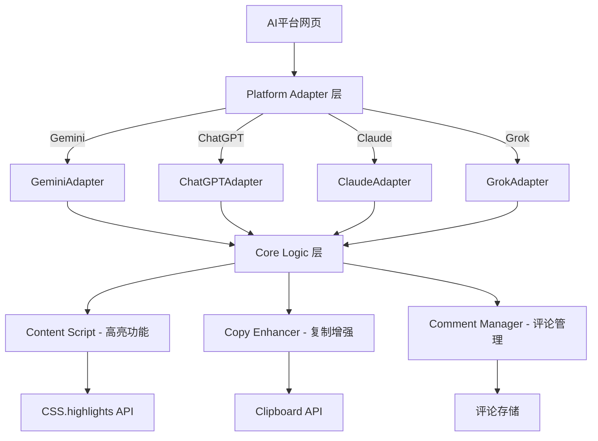

# AI Highlight Assistant - 核心架构

## 概述

AI Highlight Assistant 是一个 Chrome 浏览器扩展，为 AI 聊天平台提供文本高亮和评论功能。

**核心价值**：允许用户标记 AI 回复中的重要内容，添加个人评论，并在复制时自动包含高亮标记。

## 设计原则（Linus 哲学）

### 1. "好品味"(Good Taste) - 消除特殊情况
- 使用统一的平台适配器接口，避免为每个平台写特殊逻辑
- 用数据结构设计替代复杂的条件判断

### 2. "Never break userspace" - 零破坏性
- 劫持原生复制按钮而非创建新 UI，保持用户习惯
- 新增平台支持不影响现有功能
- 向后兼容是铁律

### 3. 实用主义 - 解决真实问题
- 零依赖：不引入任何外部框架
- 零 DOM 污染：使用 CSS.highlights API 而非修改 DOM
- 简洁代码：Less is More

### 4. 简洁执念 - 控制复杂度
- 每个模块只做一件事并做好
- 核心逻辑平台无关，差异通过适配器隔离

## 核心架构



## 平台适配器接口

**核心抽象** - 每个平台必须实现 5 个方法：

```javascript
interface PlatformAdapter {
  // 平台检测
  detectPlatform(): boolean;

  // DOM 元素识别
  findResponseContainers(): Element[];  // 查找所有 AI 回复容器
  findCopyButtons(): Element[];         // 查找所有复制按钮

  // 业务逻辑验证
  isValidResponseContainer(element: Element): boolean;  // 验证容器有效性
  getCopyButtonContainer(button: Element): Element;     // 获取按钮对应的容器
}
```

**设计原则**：
- 所有平台差异都通过这 5 个方法隔离
- 核心逻辑完全平台无关
- 新平台支持仅需实现适配器（30-50 行代码）

## 核心模块

### 1. Content Script (content.js)
**职责**：高亮功能的核心逻辑

- 监听 AI 回复区域内的文本选择
- 使用 CSS.highlights API 应用高亮（支持跨元素）
- 智能降级到传统 DOM 高亮
- Ctrl+点击移除高亮，Ctrl+Z 撤销
- 通过适配器验证 AI 回复容器

**平台无关性**：✅ 100% 平台无关

### 2. Copy Enhancer (copy-enhancer.js)
**职责**：劫持和增强原生复制功能

- 通过适配器识别 AI 回复的复制按钮
- 监听复制按钮点击事件
- 检测消息容器中的高亮内容
- 获取高亮关联的评论数据
- 生成带 `<highlight comment="">` 标签的增强文本
- 覆写剪贴板内容

**平台依赖性**：仅依赖适配器提供 DOM 元素

### 3. Comment Manager (comment-manager.js)
**职责**：评论功能管理

- 管理高亮文本的评论数据
- 显示 Material Design 风格的评论输入界面
- 处理评论的保存和编辑
- 显示评论指示器（🔖）和工具提示
- 评论数据的内存存储

**平台无关性**：✅ 100% 平台无关

## 数据模型

### 内存中高亮数据存储
```javascript
// window.highlights Map 存储
{
  1: {
    range: Range对象,
    text: "决策树",
    comment: "这个算法很直观",
    timestamp: 1640995200000,
    hasComment: true
  },
  2: {
    range: Range对象,
    text: "神经网络",
    comment: "",
    timestamp: 1640995300000,
    hasComment: false
  }
}
```

### 生成的复制内容格式
```
机器学习中，<highlight comment="这个算法很直观">决策树</highlight>容易理解，
随机森林准确率高，但<highlight>神经网络</highlight>需要更多数据。
```

## 技术决策

### 为什么选择 CSS.highlights API？
- **无 DOM 污染**：不修改页面 HTML 结构，性能更佳
- **跨元素支持**：原生支持复杂文本选择
- **现代化**：Chrome 原生 API，专为高亮场景设计
- **智能降级**：不支持时自动降级到传统 DOM 方法

### 为什么劫持原生复制按钮？
- **用户习惯**：保持原有操作流程，学习成本为零
- **界面简洁**：不添加额外 UI 元素
- **稳定性**：不依赖自定义 UI 的显示/隐藏逻辑
- **未来兼容**：平台 UI 更新时影响最小

### 为什么限制高亮范围在 AI 回复区域？
- **精确定位**：只在有意义的内容区域工作
- **避免误操作**：防止在侧边栏、输入框等地方误触
- **符合使用场景**：用户只需要高亮 AI 的回复内容

## 相关文档

- **核心功能详细说明**：[CORE-FEATURES.md](CORE-FEATURES.md)
- **平台适配器开发指南**：[platforms/README.md](platforms/README.md)
- **各平台适配器文档**：[platforms/](platforms/)
- **需求文档**：[requirements.md](requirements.md)
- **任务清单**：[tasks.md](tasks.md)
- **技术验证报告**：[verify.md](verify.md)
