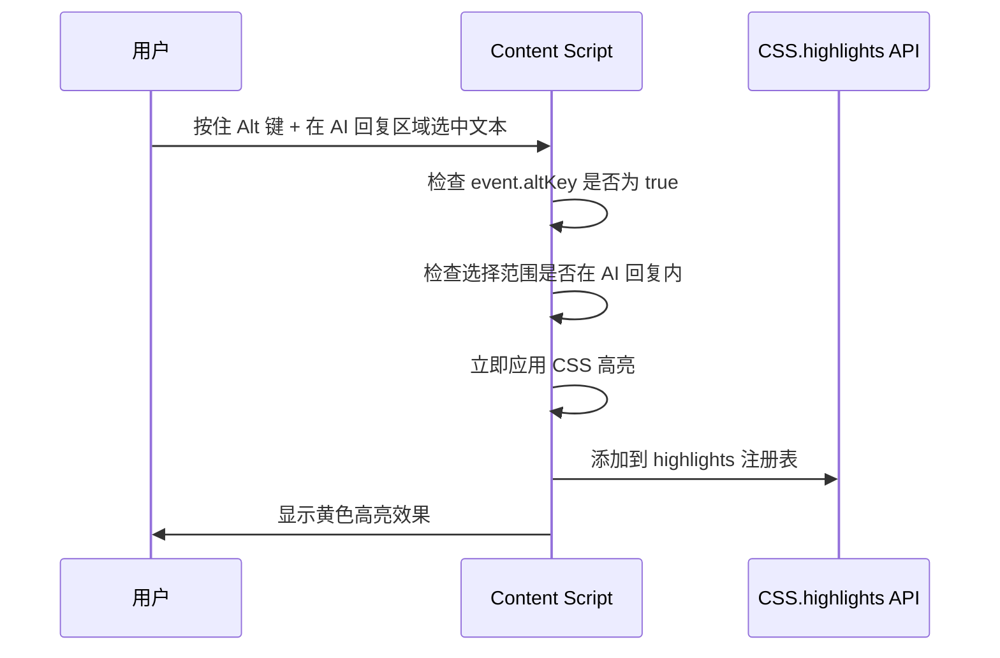
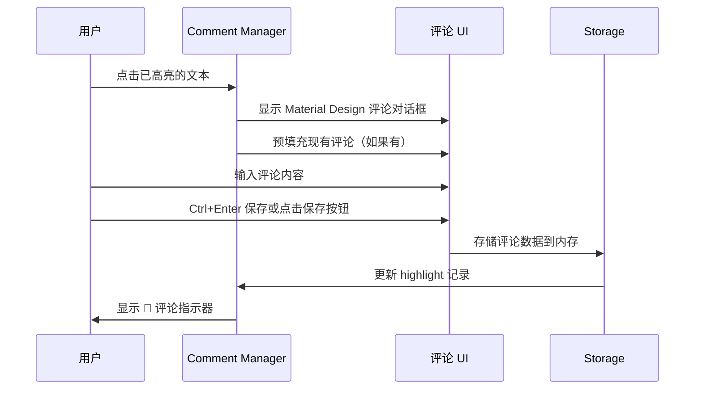
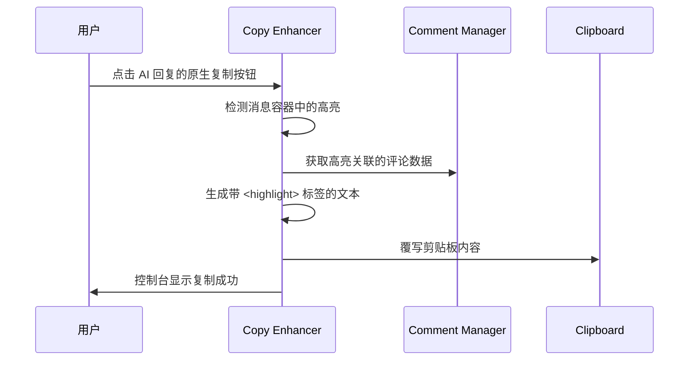

# AI Highlight Assistant - 核心功能详解（技术实现）

> **🔧 本文档 vs 📋 requirements.md - 有何不同？**
>
> | 维度 | CORE-FEATURES.md（本文档） | requirements.md |
> |-----|---------------------------|----------------|
> | **角度** | 技术实现 - **"怎么做的"** | 业务需求 - **"应该做什么"** |
> | **受众** | 开发者、技术维护者、AI助手 | 产品经理、QA测试、客户 |
> | **格式** | 流程图 + 代码示例 + API调用 | 用户故事 + 验收标准 |
> | **例子** | "使用 CSS.highlights API，代码：`highlight.add(range)`" | "WHEN 用户选中文本 THEN 系统 SHALL 高亮显示" |
>
> **简单类比**：
> - **CORE-FEATURES.md** = 施工图纸（"电梯井尺寸2m x 3m，使用混凝土C30"）
> - **requirements.md** = 建筑需求书（"这栋楼要有20层，每层要有电梯"）

---

> 本文档描述平台无关的核心功能实现。平台特定的适配逻辑见 [platforms/](platforms/) 目录。

## 功能概览

AI Highlight Assistant 提供三大核心功能：
1. **文本高亮** - Alt+选中触发，防止误触，支持跨元素选择
2. **评论管理** - 为高亮文本添加个人评论
3. **智能复制** - 复制时自动包含高亮标记和评论

## 1. 文本高亮功能

### 核心流程



### 技术实现

**使用 CSS.highlights API（优先）：**
```javascript
const range = selection.getRangeAt(0).cloneRange();
const highlight = CSS.highlights.get('ai-highlights');
highlight.add(range);
```

**降级方案（不支持时）：**
```javascript
const span = document.createElement('span');
span.className = 'ai-highlight-fallback';
range.surroundContents(span);
```

### 关键特性

- ✅ **跨元素支持** - CSS.highlights API 原生支持跨越多个 DOM 节点的选择
- ✅ **零 DOM 污染** - 不修改页面 HTML 结构
- ✅ **范围限制** - 只能在 AI 回复区域内高亮，避免误操作
- ✅ **组合键触发** - Alt+选中触发，防止复制时误触

### 高亮控制

**移除高亮**：
- `Ctrl + 点击` 高亮文本 → 移除该高亮
- 避免误触：普通点击不会移除

**撤销高亮**：
- `Ctrl + Z` → 撤销最后一个高亮
- 支持多次撤销

**相关代码**：`src/content.js`

## 2. 评论管理功能

### 核心流程



### 评论输入界面

**Material Design 风格对话框**：
- 简洁标题：直接显示高亮文本（截断显示）
- 多行文本输入框
- 快捷键：`Ctrl+Enter` 保存，`Escape` 取消
- 点击外部关闭对话框
- 保存成功后短暂提示

**防误触机制**：
- 高亮后 300ms 内不触发评论对话框
- 避免划词高亮后立即弹出输入框

### 评论显示

**指示器（🔖）**：
- 内联跟随高亮文本
- 有评论的高亮才显示
- 点击指示器可编辑评论

**悬停提示**：
- 鼠标悬停指示器 → 显示完整评论内容
- 评论超过 100 字符自动截断
- 移开鼠标提示消失

### 数据存储

**内存存储（当前实现）**：
```javascript
window.highlights = new Map();
window.highlights.set(highlightId, {
    range: Range对象,
    text: "高亮文本",
    comment: "用户评论",
    timestamp: Date.now(),
    hasComment: true
});
```

**未来增强**：Chrome Storage API 持久化存储

**相关代码**：
- `src/comment-manager.js` - 评论管理逻辑
- `styles/comment.css` - Material Design 样式

## 3. 智能复制功能

### 核心流程



### 复制内容格式

**无评论的高亮**：
```
原文内容包含<highlight>关键信息</highlight>的完整句子
```

**有评论的高亮**：
```
原文内容包含<highlight comment="这很重要">关键信息</highlight>的完整句子
```

### 技术实现要点

**1. 劫持原生复制按钮**：
- 通过平台适配器识别复制按钮
- 监听点击事件，阻止默认行为
- 生成增强内容后写入剪贴板

**2. 智能文本排序**：
- 按高亮文本在原文中的位置排序
- 确保生成的内容保持原文结构

**3. XML 安全转义**：
```javascript
function escapeXml(text) {
    return text
        .replace(/&/g, '&amp;')
        .replace(/</g, '&lt;')
        .replace(/>/g, '&gt;')
        .replace(/"/g, '&quot;')
        .replace(/'/g, '&apos;');
}
```

**4. 有无评论自动识别**：
- 检查 `hasComment` 标志
- 动态生成对应格式的标签

**相关代码**：`src/copy-enhancer.js`

## 核心流程总结

### 完整工作流

1. **用户按住 Alt + 选中 AI 回复中的文本** → 立即高亮（黄色背景）
2. **点击高亮文本** → 弹出评论输入框 → 输入并保存评论
3. **保存评论后** → 显示 🔖 指示器
4. **悬停指示器** → 显示评论内容
5. **点击原生复制按钮** → 复制带 `<highlight comment="">` 标签的增强内容
6. **Ctrl+点击高亮** → 移除高亮和评论

### 设计亮点

✅ **零学习成本** - 利用原生复制按钮，不改变用户习惯
✅ **零 DOM 污染** - CSS.highlights API，不修改页面结构
✅ **平台无关** - 核心逻辑 100% 通用，差异通过适配器隔离
✅ **优雅降级** - CSS.highlights 不支持时自动降级
✅ **专业 UI** - Material Design 风格，产品级体验

## MVP 限制

**当前版本限制**：
- 数据存储在内存中，页面刷新后丢失
- 没有批量删除、导出等管理功能
- 没有评论历史、批量编辑功能

**未来可选增强**：
- Chrome Storage 持久化存储
- 快捷键自定义
- 多主题高亮颜色
- 评论模板功能

## 相关文档

- **架构设计**：[ARCHITECTURE.md](ARCHITECTURE.md)
- **平台适配器开发**：[platforms/README.md](platforms/README.md)
- **需求文档**：[requirements.md](requirements.md)
