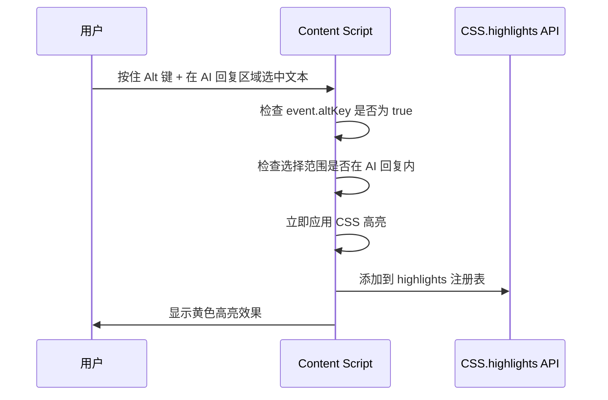
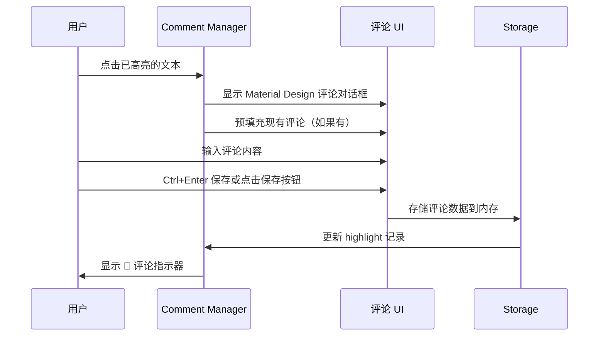
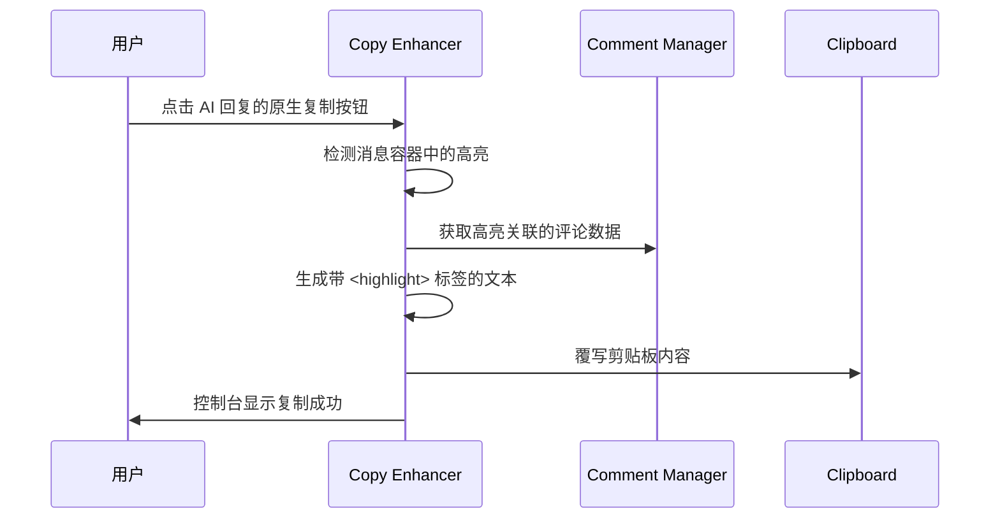
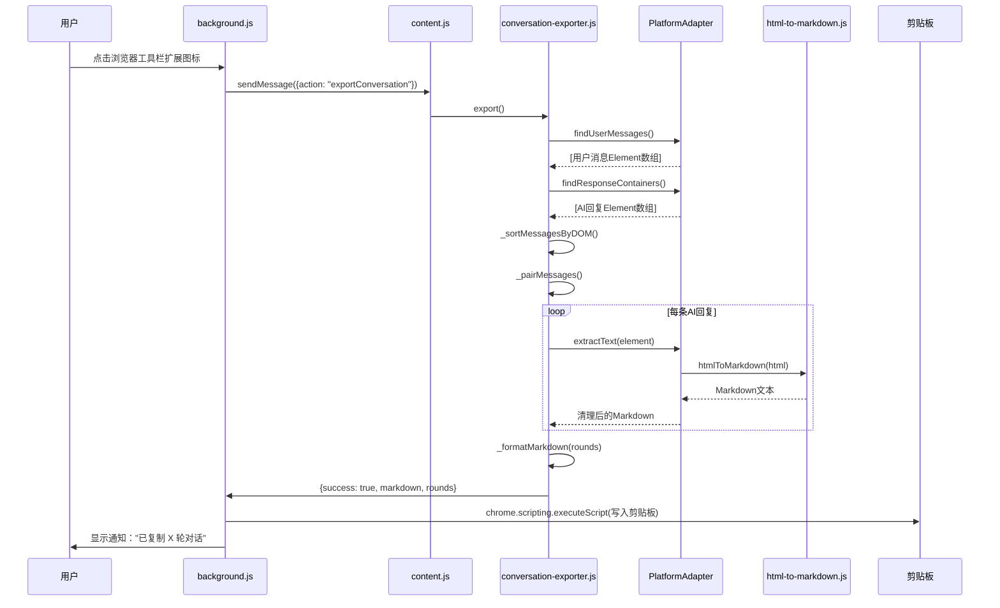

# AI Highlight Assistant - 核心功能详解（技术实现）

> **🔧 本文档 vs 📋 requirements.md - 有何不同？**
>
> | 维度 | CORE-FEATURES.md（本文档） | requirements.md |
> |-----|---------------------------|----------------|
> | **角度** | 技术实现 - **"怎么做的"** | 业务需求 - **"应该做什么"** |
> | **受众** | 开发者、技术维护者、AI助手 | 产品经理、QA测试、客户 |
> | **格式** | 流程图 + 代码示例 + API调用 | 用户故事 + 验收标准 |
> | **例子** | "使用 CSS.highlights API，代码：`highlight.add(range)`" | "WHEN 用户选中文本 THEN 系统 SHALL 高亮显示" |
>
> **简单类比**：
> - **CORE-FEATURES.md** = 施工图纸（"电梯井尺寸2m x 3m，使用混凝土C30"）
> - **requirements.md** = 建筑需求书（"这栋楼要有20层，每层要有电梯"）

---

> 本文档描述平台无关的核心功能实现。平台特定的适配逻辑见 [platforms/](platforms/) 目录。

## 功能概览

AI Highlight Assistant 提供四大核心功能：
1. **文本高亮** - Alt+选中触发，防止误触，支持跨元素选择
2. **评论管理** - 为高亮文本添加个人评论
3. **智能复制** - 复制时自动包含高亮标记和评论
4. **🆕 完整对话导出** - 一键导出整个对话为结构化Markdown

## 1. 文本高亮功能

### 核心流程



### 技术实现

**使用 CSS.highlights API（优先）：**
```javascript
const range = selection.getRangeAt(0).cloneRange();
const highlight = CSS.highlights.get('ai-highlights');
highlight.add(range);
```

**降级方案（不支持时）：**
```javascript
const span = document.createElement('span');
span.className = 'ai-highlight-fallback';
range.surroundContents(span);
```

### 关键特性

- ✅ **跨元素支持** - CSS.highlights API 原生支持跨越多个 DOM 节点的选择
- ✅ **零 DOM 污染** - 不修改页面 HTML 结构
- ✅ **范围限制** - 只能在 AI 回复区域内高亮，避免误操作
- ✅ **组合键触发** - Alt+选中触发，防止复制时误触

### 高亮控制

**移除高亮**：
- `Ctrl + 点击` 高亮文本 → 移除该高亮
- 避免误触：普通点击不会移除

**撤销高亮**：
- `Ctrl + Z` → 撤销最后一个高亮
- 支持多次撤销

**相关代码**：`src/content.js`

## 2. 评论管理功能

### 核心流程



### 评论输入界面

**Material Design 风格对话框**：
- 简洁标题：直接显示高亮文本（截断显示）
- 多行文本输入框
- 快捷键：`Ctrl+Enter` 保存，`Escape` 取消
- 点击外部关闭对话框
- 保存成功后短暂提示

**防误触机制**：
- 高亮后 300ms 内不触发评论对话框
- 避免划词高亮后立即弹出输入框

### 评论显示

**指示器（🔖）**：
- 内联跟随高亮文本
- 有评论的高亮才显示
- 点击指示器可编辑评论

**悬停提示**：
- 鼠标悬停指示器 → 显示完整评论内容
- 评论超过 100 字符自动截断
- 移开鼠标提示消失

### 数据存储

**内存存储（当前实现）**：
```javascript
window.highlights = new Map();
window.highlights.set(highlightId, {
    range: Range对象,
    text: "高亮文本",
    comment: "用户评论",
    timestamp: Date.now(),
    hasComment: true
});
```

**未来增强**：Chrome Storage API 持久化存储

**相关代码**：
- `src/comment-manager.js` - 评论管理逻辑
- `styles/comment.css` - Material Design 样式

## 3. 智能复制功能

### 核心流程



### 复制内容格式

**无评论的高亮**：
```
原文内容包含<highlight>关键信息</highlight>的完整句子
```

**有评论的高亮**：
```
原文内容包含<highlight comment="这很重要">关键信息</highlight>的完整句子
```

### 技术实现要点

**1. 劫持原生复制按钮**：
- 通过平台适配器识别复制按钮
- 监听点击事件，阻止默认行为
- 生成增强内容后写入剪贴板

**2. 智能文本排序**：
- 按高亮文本在原文中的位置排序
- 确保生成的内容保持原文结构

**3. XML 安全转义**：
```javascript
function escapeXml(text) {
    return text
        .replace(/&/g, '&amp;')
        .replace(/</g, '&lt;')
        .replace(/>/g, '&gt;')
        .replace(/"/g, '&quot;')
        .replace(/'/g, '&apos;');
}
```

**4. 有无评论自动识别**：
- 检查 `hasComment` 标志
- 动态生成对应格式的标签

### 平台特定清理（Gemini 引用标记）

**问题背景**：

Gemini 平台在用户复制 AI 回复时，会自动插入引用标记，破坏内容的可读性和格式：
- `[cite_start]` - 标记引用内容的开始
- `[cite: 1]` 或 `[cite: 1, 2, 3]` - 引用来源的编号

示例：
```
原始回复：
这是第一段内容
代码块示例：
  function test() {
    return true;
  }

Gemini 复制结果：
这是第一段内容[cite_start][cite: 1]代码块示例：  function test() {    return true;  }
```

**问题影响**：
- ❌ 引用标记破坏可读性
- ❌ 代码块格式被压缩成一行
- ❌ 列表和段落结构丢失

**解决方案**：

使用 **正则表达式精准清理**（`copy-enhancer.js`）：

```javascript
function cleanGeminiCitations(text) {
  if (!text) return text;

  // 删除 [cite_start] 标记
  let cleaned = text.replace(/\[cite_start\]/g, '');

  // 删除 [cite: X] 标记（只删除标记本身，不删除周围的空白）
  cleaned = cleaned.replace(/\[cite:\s*[\d,\s]+\]/g, '');

  // 只清理连续的空格（不包括换行符）
  cleaned = cleaned.replace(/ {1,}/g, ' ');

  return cleaned;
}
```

**关键设计原则**：

- ✅ **只删除标记本身** - 不删除换行符 `\n`、制表符 `\t` 等格式字符
- ✅ **保留用户数据** - 代码块、列表、段落格式完全保留
- ✅ **精准匹配** - 使用正则表达式精确匹配引用标记模式
- ✅ **简洁实用** - 只在剪贴板字符串级别清理，无需 DOM 操作

**验证标准**：
- ✅ 复制代码块时保留换行符和缩进
- ✅ 引用标记 `[cite_start]` 和 `[cite: X]` 完全清除
- ✅ 段落、列表格式不受影响

**常见陷阱**：

⚠️ **错误做法**（会破坏格式）：
```javascript
// ❌ 这会删除所有空白字符，包括换行符！
text.replace(/\s+/g, ' ')

// ❌ 这会删除引用标记前的换行符！
text.replace(/\s*\[cite:\s*[\d,\s]+\]/g, '')
```

✅ **正确做法**（只删除标记）：
```javascript
// ✅ 只删除标记本身
text.replace(/\[cite:\s*[\d,\s]+\]/g, '')
```

**相关代码**：
- `src/copy-enhancer.js` - 剪贴板清理逻辑（`cleanGeminiCitations()` 函数）

---

## 4. 完整对话导出功能 🆕

### 核心流程



### 功能目标

**问题背景**：
- 用户需要记录完整AI对话用于回顾学习、分享或存档
- 浏览器直接复制整个页面：格式混乱，无法使用
- 逐条点击复制按钮：每次耗时10分钟，效率极低
- 粘贴后的内容：无法区分用户和AI，看不清对话轮次

**解决方案**：
- 一键导出：点击扩展图标，自动复制整个对话
- 结构化Markdown：清晰标记轮次、发言者、平台、时间戳
- 格式完美保留：集成Turndown库，代码块、列表、加粗等格式完整保留

### 技术实现

#### 1. 数据提取（平台适配器）

**Gemini平台实现**（`gemini-adapter.js`）：

```javascript
/**
 * 查找用户消息容器
 */
findUserMessages() {
  return Array.from(document.querySelectorAll('user-query'));
}

/**
 * 提取文本内容（HTML→Markdown）
 */
extractText(container) {
  if (container.tagName.toLowerCase() === 'user-query') {
    // 用户消息：提取纯文本
    const textElement = container.querySelector('.query-text');
    return textElement ? textElement.textContent.trim() : '';
  } else {
    // AI回复：提取HTML并转换为Markdown
    const cloned = container.cloneNode(true);

    // 移除UI元素（按钮、图标等）
    ['source-footnote', 'mat-icon', 'button'].forEach(selector => {
      cloned.querySelectorAll(selector).forEach(el => el.remove());
    });

    const html = cloned.innerHTML;

    // 使用Turndown转换为Markdown
    const markdown = window.htmlToMarkdown(html);

    // 清理Gemini引用标记
    return this._cleanGeminiCitations(markdown);
  }
}
```

#### 2. DOM排序（conversation-exporter.js）

```javascript
/**
 * 按DOM顺序排序消息
 */
_sortMessagesByDOM(messages) {
  return messages.sort((a, b) => {
    const position = a.element.compareDocumentPosition(b.element);

    if (position & Node.DOCUMENT_POSITION_FOLLOWING) {
      return -1; // a 在前
    }
    if (position & Node.DOCUMENT_POSITION_PRECEDING) {
      return 1; // b 在前
    }
    return 0;
  });
}
```

#### 3. 消息配对

```javascript
/**
 * 配对消息（用户问题 + AI回答 = 一轮对话）
 */
_pairMessages(sortedMessages) {
  const rounds = [];
  let currentRound = null;

  for (const message of sortedMessages) {
    if (message.type === 'user') {
      // 保存上一轮，开始新一轮
      if (currentRound && currentRound.user) {
        rounds.push(currentRound);
      }
      currentRound = { user: message.text };
    } else if (message.type === 'ai') {
      // AI回复
      if (currentRound) {
        currentRound.ai = message.text;
      } else {
        // 没有配对的AI回复（页面刷新后只看到AI回复）
        currentRound = { ai: message.text };
      }
    }
  }

  if (currentRound) {
    rounds.push(currentRound);
  }

  return rounds;
}
```

#### 4. Markdown格式化

```javascript
/**
 * 格式化为Markdown
 */
_formatMarkdown(rounds) {
  const platformName = this.platformAdapter.getPlatformDisplayName();
  const timestamp = `${year}-${month}-${day} ${hours}:${minutes}`;

  let markdown = `# 对话记录 ${timestamp}\n\n`;
  markdown += `**平台：** ${platformName}\n\n`;
  markdown += `---\n\n`;

  rounds.forEach((round, index) => {
    markdown += `## 第${index + 1}轮\n\n`;

    if (round.user) {
      markdown += `<*用户*>\n${round.user}\n\n`;
    }

    if (round.ai) {
      markdown += `<*${platformName}*>\n${round.ai}\n\n`;
    }
  });

  return markdown;
}
```

#### 5. HTML→Markdown转换（Turndown库）

**为什么引入Turndown？**
- 🎯 **问题**：Gemini的AI回复是复杂HTML（代码块、列表、加粗等）
- ❌ **方案1**：`textContent` → 丢失所有格式
- ❌ **方案2**：自己实现HTML→Markdown → 重新造轮子，代码复杂
- ✅ **方案3**：引入Turndown库 → 16.7k stars，成熟稳定，零依赖

**Turndown封装**（`html-to-markdown.js`）：

```javascript
function htmlToMarkdown(html) {
  const turndownService = new TurndownService({
    codeBlockStyle: 'fenced',  // 使用 ``` 而非缩进
    headingStyle: 'atx',       // 使用 # 而非下划线
    bulletListMarker: '-',
    hr: '---',
    br: '\n'
  });

  // 自定义规则：处理代码块的语言标识
  turndownService.addRule('fencedCodeBlock', {
    filter: (node) => {
      return node.nodeName === 'PRE' &&
             node.firstChild &&
             node.firstChild.nodeName === 'CODE';
    },
    replacement: (content, node) => {
      const code = node.firstChild;
      let language = '';

      // 提取语言标识（如 class="language-python"）
      if (code.className) {
        const match = code.className.match(/language-(\w+)/);
        if (match) language = match[1];
      }

      return '\n```' + language + '\n' + code.textContent + '\n```\n';
    }
  });

  return turndownService.turndown(html);
}
```

### 输出格式示例

```markdown
# 对话记录 2025-01-15 14:30

**平台：** Gemini

---

## 第1轮

<*用户*>
帮我写一个Python函数计算斐波那契数列

<*Gemini*>
好的，这是一个计算斐波那契数列的Python函数：

```python
def fibonacci(n):
    if n <= 1:
        return n
    return fibonacci(n-1) + fibonacci(n-2)
```

这个函数使用递归实现...

## 第2轮

<*用户*>
能否优化一下性能？

<*Gemini*>
当然，可以使用动态规划：

```python
def fibonacci_dp(n):
    if n <= 1:
        return n

    dp = [0] * (n + 1)
    dp[1] = 1

    for i in range(2, n + 1):
        dp[i] = dp[i-1] + dp[i-2]

    return dp[n]
```
```

### 关键特性

✅ **格式完美保留**：
- 代码块语法高亮（\`\`\`python）
- 列表缩进和结构
- 加粗、斜体、引用等Markdown格式

✅ **智能清理**：
- 移除平台UI元素（按钮、图标）
- 清理Gemini引用标记（`[cite: X]`）
- 保留用户数据（代码、格式）

✅ **错误处理**：
- 空页面检测："未检测到对话内容"
- 未支持平台："当前平台不支持对话导出"
- 单条消息失败：跳过继续，不中断流程

✅ **平台适配**：
- 当前支持：Gemini ✅
- 开发中：Claude、ChatGPT、Grok（Phase 2）

### 设计亮点

**数据结构优先（Linus哲学）**：
```
DOM元素 → 消息数组 → 配对轮次 → Markdown字符串
```
清晰的单向数据流，无复杂状态管理

**消除特殊情况**：
- 严格的一问一答配对，无需处理复杂轮次判断
- 统一的平台适配器接口，无需为每个平台写特殊逻辑

**零破坏性**：
- 完全独立的新功能，不影响现有高亮/评论/单条复制功能
- 向后兼容是铁律

**最小依赖原则**：
- 仅引入必要的、成熟的、零依赖的第三方库（Turndown）
- 避免重新造轮子

### 相关代码

- **核心逻辑**：`src/conversation-exporter.js` - 导出流程控制
- **平台适配**：`src/platform/gemini-adapter.js` - Gemini平台实现
- **格式转换**：`src/utils/html-to-markdown.js` - Turndown封装
- **第三方库**：`src/libs/turndown.js` - Turndown库（26KB）
- **消息传递**：
  - `src/background.js:9-107` - 扩展图标点击处理
  - `src/content.js:466-482` - 消息监听

---

## 核心流程总结

### 完整工作流

**单条AI回复增强复制**：
1. **用户按住 Alt + 选中 AI 回复中的文本** → 立即高亮（黄色背景）
2. **点击高亮文本** → 弹出评论输入框 → 输入并保存评论
3. **保存评论后** → 显示 🔖 指示器
4. **悬停指示器** → 显示评论内容
5. **点击原生复制按钮** → 复制带 `<highlight comment="">` 标签的增强内容
6. **Ctrl+点击高亮** → 移除高亮和评论

**完整对话导出**：
1. **点击浏览器工具栏扩展图标** → 自动提取整个对话
2. **系统处理** → DOM排序 → 配对轮次 → Markdown格式化
3. **写入剪贴板** → 显示通知："已复制 X 轮对话"
4. **粘贴到编辑器** → 得到结构化Markdown（轮次、发言者、平台、时间戳）

### 设计亮点

✅ **零学习成本** - 利用原生复制按钮，不改变用户习惯；扩展图标一键导出
✅ **零 DOM 污染** - CSS.highlights API，不修改页面结构
✅ **平台无关** - 核心逻辑 100% 通用，差异通过适配器隔离
✅ **优雅降级** - CSS.highlights 不支持时自动降级
✅ **专业 UI** - Material Design 风格，产品级体验
✅ **🆕 完整对话导出** - 一键复制整个对话，结构化Markdown，格式完美保留
✅ **🆕 最小依赖原则** - 仅引入成熟的、零依赖的第三方库（Turndown）

## MVP 限制

**当前版本限制**：
- 数据存储在内存中，页面刷新后丢失
- 没有批量删除、导出等管理功能
- 没有评论历史、批量编辑功能

**未来可选增强**：
- Chrome Storage 持久化存储
- 快捷键自定义
- 多主题高亮颜色
- 评论模板功能

## 相关文档

- **架构设计**：[ARCHITECTURE.md](ARCHITECTURE.md)
- **平台适配器开发**：[platforms/README.md](platforms/README.md)
- **需求文档**：[requirements.md](requirements.md)
