# AI Highlight Assistant - 设计文档

## 概述

AI Highlight Assistant 是一个Chrome浏览器扩展，允许用户在AI聊天平台的AI回复中高亮重要文本并添加个人评论，通过劫持原生复制按钮来复制包含高亮标记和评论的完整AI回复内容。

## 架构演进

### 阶段1：MVP实现（Gemini平台）✅ 已完成
**专注单平台，验证核心价值**

**已实现的核心功能：**
- ✅ 在AI回复区域内选中文本立即高亮（CSS.highlights API + 智能降级）
- ✅ Ctrl+点击移除高亮，Ctrl+Z撤销高亮
- ✅ 劫持AI回复原生复制按钮，智能生成带`<highlight>`标签的内容
- ✅ 高亮范围限制在AI回复区域，避免误操作
- ✅ 点击高亮文本显示Material Design评论对话框
- ✅ 评论与高亮文本关联存储，🔖指示器显示
- ✅ 复制时包含评论信息：`<highlight comment="评论">文本</highlight>`

### 阶段2：多平台架构重构 ✅ 已完成
**保持功能不变，重构为平台无关架构**

**重构成果：**
- ✅ 提取平台特定逻辑到适配器层
- ✅ 核心高亮/评论逻辑保持不变
- ✅ 统一适配器接口，为多平台支持奠定基础
- ✅ 零破坏性：Gemini用户体验完全不变

## 架构设计（重构后实现）

```mermaid
graph TD
    A[AI平台网页] --> B[Platform Adapter]
    B --> |Gemini| BA[GeminiAdapter]
    B --> |Future| BB[ChatGPTAdapter]
    B --> |Future| BC[ClaudeAdapter]
    
    BA --> C[Content Script]
    BA --> D[Copy Enhancer]
    C --> E[CSS.highlights API]
    C --> F[高亮范围检查]
    D --> G[复制按钮识别]
    D --> H[智能内容生成]
    D --> I[Clipboard API]
    
    C --> J[Comment Manager]
    J --> K[评论输入框]
    J --> L[评论存储]
    J --> M[评论指示器]
    J --> N[悬停工具提示]
```



## 核心组件

### 1. Content Script (`content.js`) ✅ 已完成重构
负责高亮功能的核心逻辑，已集成平台适配器

**职责：**
- 🆕 初始化平台适配器，统一接口抽象
- 监听AI回复区域内的文本选择
- 使用CSS.highlights API应用高亮（支持跨元素）
- 智能降级到传统DOM高亮
- Ctrl+点击移除高亮，Ctrl+Z撤销
- 🆕 通过适配器验证AI回复容器
- 🆕 与Comment Manager协作处理点击事件

**关键方法：**
```javascript
// 🆕 适配器初始化
initPlatformAdapter()
// 🆕 使用适配器验证容器
isAIResponseContainer(element)
// 检查选择范围
isSelectionInAIResponse(selection)
// CSS高亮
applyHighlightCSS(selection)
// 传统高亮（降级）
applyHighlightFallback(selection)
// 移除高亮
removeHighlightAtPoint(clickPoint)
// 🆕 处理高亮点击事件
handleHighlightClick(event)
```

### 2. Copy Enhancer (`copy-enhancer.js`) ✅ 已完成重构
负责劫持和增强原生复制功能，已集成平台适配器

**职责：**
- 🆕 初始化平台适配器，统一接口抽象
- 🆕 通过适配器精确识别AI回复的复制按钮
- 监听复制按钮点击事件
- 🆕 通过适配器查找消息容器
- 检测消息容器中的高亮内容
- 🆕 获取高亮关联的评论数据
- 生成带`<highlight comment="">`标签的增强文本
- 覆写剪贴板内容

**关键方法：**
```javascript
// 🆕 适配器初始化
initPlatformAdapter()
// 🆕 使用适配器识别复制按钮
findAndSetupCopyButtons()
// 处理复制点击
handleCopyButtonClick(button, event)
// 🆕 使用适配器查找消息容器
findMessageContainer(button)
// 🆕 生成包含评论的增强内容
generateHighlightedTextWithComments(container)
// 剪贴板操作
copyToClipboard(text)
```

### 3. Comment Manager (`comment-manager.js`) 🆕 新增组件
负责评论功能的核心逻辑

**职责：**
- 管理高亮文本的评论数据
- 显示评论输入界面
- 处理评论的保存和编辑
- 显示评论指示器和工具提示
- 评论数据的持久化存储

**关键方法：**
```javascript
// 显示评论输入框
showCommentInput(highlightId, position)
// 保存评论
saveComment(highlightId, comment)
// 显示评论指示器
showCommentIndicator(highlightElement)
// 显示评论工具提示
showCommentTooltip(highlightElement, comment)
// 获取高亮的评论
getHighlightComment(highlightId)
```

## 数据模型（MVP简化版）

### 内存中高亮数据存储（含评论）
```javascript
// window.highlights Map存储
{
  1: {
    range: Range对象,
    text: "决策树", 
    comment: "这个算法很直观",
    timestamp: 1640995200000,
    hasComment: true
  },
  2: {
    range: Range对象,
    text: "神经网络",
    comment: "",
    timestamp: 1640995300000,
    hasComment: false
  }
}
```

### 生成的复制内容格式（含评论）
```
机器学习中，<highlight comment="这个算法很直观">决策树</highlight>容易理解，随机森林准确率高，但<highlight>神经网络</highlight>需要更多数据。
```

## 核心流程（MVP实现）

### 1. 高亮文本流程 ✅

```mermaid
sequenceDiagram
    participant U as 用户
    participant C as Content Script
    participant H as CSS.highlights
    
    U->>C: 在AI回复区域选中文本
    C->>C: 检查选择范围是否在AI回复内
    C->>C: 立即应用CSS高亮
    C->>H: 添加到highlights注册表
    C->>U: 显示黄色高亮效果
```


### 2. 智能复制流程（含评论）✅

```mermaid
sequenceDiagram
    participant U as 用户
    participant E as Copy Enhancer
    participant CM as Comment Manager
    participant CB as Clipboard
    
    U->>E: 点击AI回复的复制按钮
    E->>E: 检测消息容器中的高亮
    E->>CM: 获取高亮关联的评论数据
    E->>E: 生成带<highlight comment="">标签的文本
    E->>CB: 覆写剪贴板内容
    E->>U: 控制台显示复制成功
```


### 3. 移除高亮流程 ✅

```mermaid
sequenceDiagram
    participant U as 用户
    participant C as Content Script
    participant H as CSS.highlights
    participant CM as Comment Manager
    
    U->>C: Ctrl+点击高亮文本 或 Ctrl+Z
    C->>C: 检测点击位置或获取最后高亮
    C->>CM: 移除关联的评论数据
    C->>H: 从highlights注册表中移除
    C->>U: 高亮效果消失
```


### 4. 添加评论流程 🆕

```mermaid
sequenceDiagram
    participant U as 用户
    participant CM as Comment Manager
    participant UI as 评论UI
    participant S as Storage
    
    U->>CM: 点击已高亮的文本
    CM->>UI: 显示评论输入框
    CM->>UI: 预填充现有评论（如果有）
    U->>UI: 输入评论内容
    U->>UI: 保存评论
    UI->>S: 存储评论数据
    S->>CM: 更新highlight记录
    CM->>U: 显示评论指示器
```


### 5. 评论悬停显示流程 🆕

```mermaid
sequenceDiagram
    participant U as 用户
    participant CM as Comment Manager
    participant TT as Tooltip
    
    U->>CM: 鼠标悬停在有评论的高亮文本
    CM->>CM: 检查是否有评论
    CM->>TT: 显示评论工具提示
    U->>CM: 鼠标移开
    CM->>TT: 隐藏工具提示
```


## 技术决策（MVP实现）

### 1. 为什么选择CSS.highlights API？
- **无DOM污染：** 不修改页面HTML结构，性能更佳
- **跨元素支持：** 原生支持复杂文本选择，解决surroundContents问题
- **现代化：** Chrome原生API，专为高亮场景设计
- **智能降级：** 不支持时自动降级到传统DOM方法

### 2. 为什么劫持原生复制按钮而不是创建新UI？
- **用户习惯：** 保持原有操作流程，学习成本为零
- **界面简洁：** 不添加额外UI元素，不影响页面布局
- **稳定性：** 不依赖自定义UI的显示/隐藏逻辑
- **未来兼容：** 当Gemini UI更新时影响最小

### 3. 为什么限制高亮范围在AI回复区域？
- **精确定位：** 只在有意义的内容区域工作
- **避免误操作：** 防止在侧边栏、输入框等地方误触
- **符合使用场景：** 用户只需要高亮AI的回复内容

### 4. 评论功能的设计考虑 🆕
- **点击触发：** 点击高亮文本即可添加评论，操作简单直观
- **指示器显示：** 有评论的高亮文本显示小图标，区分有无评论
- **悬停显示：** 鼠标悬停显示评论内容，不占用页面空间
- **格式统一：** 复制时使用`comment`属性，与高亮标签统一

## 当前限制与未来增强

## 多平台架构设计（阶段2规划）

### 设计原则
遵循"好品味"架构设计：
1. **消除特殊情况** - 统一接口，平台差异通过适配器隔离
2. **Never break userspace** - Gemini用户的现有体验完全不变
3. **数据结构优先** - 核心逻辑不依赖具体平台
4. **简洁扩展** - 新平台支持只需实现适配器接口

### 平台适配器接口
```javascript
// 核心抽象 - 每个平台必须实现
interface PlatformAdapter {
  // 平台检测
  detectPlatform(): boolean;
  
  // DOM元素识别
  findResponseContainers(): Element[];
  findCopyButtons(): Element[];
  
  // 业务逻辑验证
  isValidResponseContainer(element: Element): boolean;
  getCopyButtonContainer(button: Element): Element;
}
```

### 重构后架构图

```mermaid
graph TD
    A[多平台检测] --> B{平台类型}
    B -->|Gemini| C[GeminiAdapter]
    B -->|ChatGPT| D[ChatGPTAdapter]
    B -->|Claude| E[ClaudeAdapter]
    
    C --> F[Platform Interface]
    D --> F
    E --> F
    
    F --> G[Core Highlight Logic]
    F --> H[Core Comment Logic]
    F --> I[Core Copy Logic]
    
    G --> J[CSS.highlights API]
    H --> K[Comment Manager]
    I --> L[Copy Enhancer]
```


### 重构策略
**阶段2.1：提取适配器接口** ✅ 已完成
- ✅ 创建`PlatformAdapter`基类和`GeminiAdapter`实现
- ✅ 现有功能完全不变，只是包装一层

**阶段2.2：重构核心逻辑** ✅ 已完成
- ✅ `content.js`调用适配器接口而非硬编码逻辑
- ✅ `copy-enhancer.js`使用适配器识别复制按钮
- ✅ 保持所有现有API和行为不变

**阶段2.3：多平台扩展实践** ✅ 已完成
- ✅ Claude平台适配：验证架构可行性
- ✅ Grok平台适配：发现和解决关键设计陷阱
- ✅ 总结标准化开发流程和最佳实践

## 平台适配器设计经验（基于Grok开发总结）

### 关键设计原则：消除特殊情况

**Linus哲学**：*"好品味就是能够预见特殊情况，并将其设计成通用情况"*

基于Grok平台开发经验，我们发现了适配器设计的3个核心陷阱：

#### 1. DOM结构陷阱：理论vs实践的冲突
**错误模式**：基于DOM片段假设父子关系
```javascript
// ❌ 错误：假设直接包含关系
element.querySelector('.action-buttons')

// ✅ 正确：向上查找共同父容器
function findCommonParent(element) {
    let current = element;
    while (current && current !== document.body) {
        const bubble = current.querySelector('.message-bubble');
        const actions = current.querySelector('.action-buttons');
        if (bubble && actions) return current;
        current = current.parentElement;
    }
}
```

#### 2. 消息类型陷阱：用户vs AI的混淆
**问题**：所有消息使用相同class，需要布局区分
```javascript
// ✅ 正确：基于布局方向和宽度区分
const isAIResponse = parent.classList.contains('items-start') && 
                    messageBubble.classList.contains('w-full');
```

#### 3. 逻辑一致性陷阱：双重实现导致断链
**解决方案**：统一逻辑，消除重复
```javascript
class PlatformAdapter {
    // 核心逻辑只实现一次
    _findCommonParent(element) { /* 统一实现 */ }
    
    // 所有方法复用核心逻辑
    isValidResponseContainer(element) {
        return this._findCommonParent(element) !== null;
    }
    
    getCopyButtonContainer(button) {
        return this._findCommonParent(button.closest('.action-buttons'));
    }
}
```

### 标准化开发流程

**时间分配原则**：
- **60%** - DOM结构深度分析（Grok经验：不能低于这个比例！）
- **30%** - 标准化代码实现
- **10%** - 调试验证

**质量保证检查清单**：
- [ ] 3个核心功能流程全部通过
- [ ] 适配器识别数量与页面实际匹配
- [ ] 用户消息不会被误选
- [ ] 所有方法使用统一的核心逻辑

### 适配器模板化设计

基于Grok、Claude、Gemini三平台经验，形成了标准适配器模板：

```javascript
class StandardPlatformAdapter extends PlatformAdapter {
    // 1. 简单平台检测
    detectPlatform() {
        return window.location.hostname.includes('platform.com');
    }
    
    // 2. 基于action-buttons反向查找容器
    findResponseContainers() {
        const actionButtons = document.querySelectorAll('.action-selector');
        return this._filterAIContainers(actionButtons);
    }
    
    // 3. 复用容器查找逻辑
    findCopyButtons() {
        const buttons = document.querySelectorAll('button[aria-label*="复制"]');
        return Array.from(buttons).filter(btn => 
            this.getCopyButtonContainer(btn) !== null
        );
    }
    
    // 4-5. 使用相同的核心逻辑
    isValidResponseContainer(element) {
        return this._findAIContainer(element) !== null;
    }
    
    getCopyButtonContainer(button) {
        return this._findAIContainer(button.closest('.action-selector'));
    }
    
    // 核心逻辑：统一的AI容器查找
    _findAIContainer(startElement) {
        if (!startElement) return null;
        
        let parent = startElement.parentElement;
        while (parent && parent !== document.body) {
            const bubble = parent.querySelector('.message-selector');
            const actions = parent.querySelector('.action-selector');
            
            if (bubble && actions) {
                // 平台特定的AI识别逻辑
                if (this._isAIResponse(parent, bubble)) {
                    return parent;
                }
            }
            parent = parent.parentElement;
        }
        return null;
    }
    
    // 平台特定的AI识别逻辑（需要子类实现）
    _isAIResponse(container, messageBubble) {
        throw new Error('Must implement platform-specific AI detection');
    }
}
```

### 架构进化成果

通过三个平台的实践，平台适配器架构已经达到：

1. **零破坏性扩展** - 新增平台不影响现有功能
2. **标准化流程** - 60/30/10时间分配 + 检查清单  
3. **模板化开发** - 统一代码模式，减少错误
4. **经验沉淀** - 详细文档避免重复踩坑

**下一个平台（ChatGPT）开发策略**：严格遵循`platform-development.md`标准流程，预计开发时间可缩短50%。

**阶段2.3：验证Gemini功能** ✅ 已完成
- ✅ 确保重构后Gemini平台100%功能正常
- ✅ 性能和用户体验无任何退化
- ✅ 统一架构，消除硬编码依赖

**阶段2.4：添加新平台** 🎯 准备就绪
- 架构已就绪，实现`ChatGPTAdapter`和`ClaudeAdapter`
- 每个适配器只需30-50行代码

### MVP限制（保持不变）
- **数据持久化：** 当前高亮和评论数据存储在内存中，页面刷新后丢失
- **高亮管理：** 没有批量删除、导出等管理功能
- **评论管理：** 没有评论历史、批量编辑功能

### 未来可选增强
- Chrome Storage持久化存储（高亮+评论）
- 快捷键自定义（添加评论快捷键）
- 多主题高亮颜色